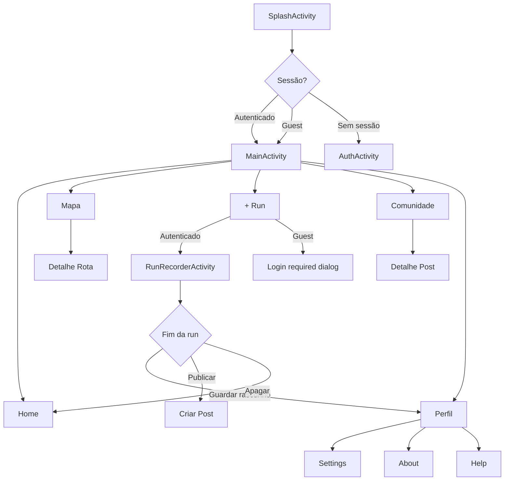
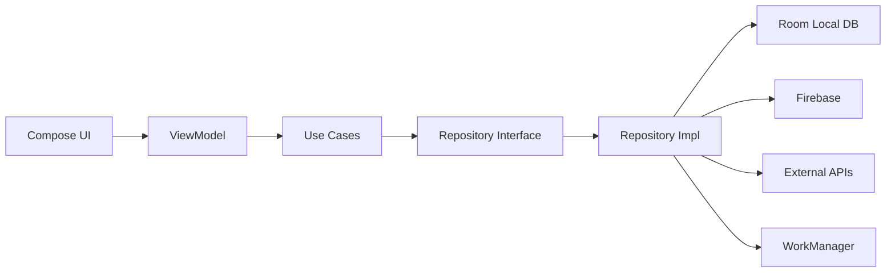
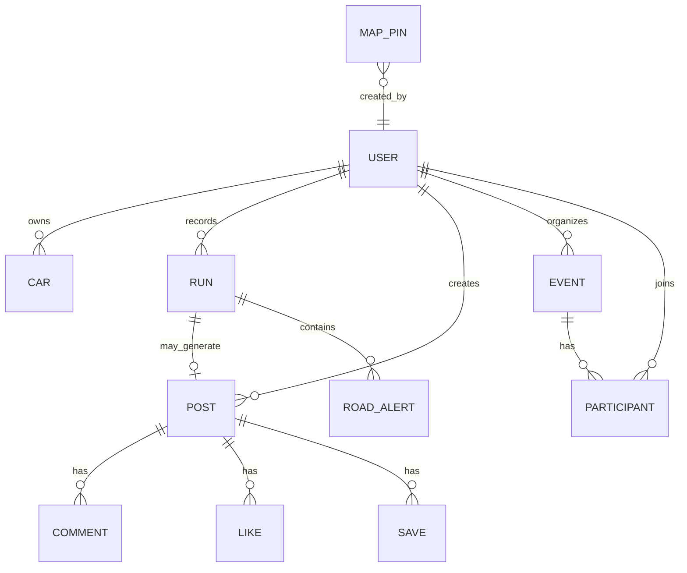
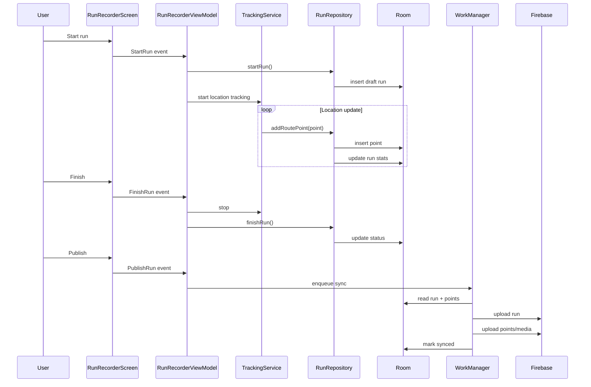

# Diagramas Mermaid para documentação

## Navegação

```mermaid
flowchart TD
    Splash[SplashActivity] --> Auth{Sessão?}
    Auth -->|Autenticado| Main[MainActivity]
    Auth -->|Guest| Main
    Auth -->|Sem sessão| AuthActivity[AuthActivity]

    Main --> Home[Home]
    Main --> Map[Mapa]
    Main --> RunEntry[+ Run]
    Main --> Community[Comunidade]
    Main --> Profile[Perfil]

    RunEntry -->|Autenticado| RunRecorder[RunRecorderActivity]
    RunEntry -->|Guest| LoginRequired[Login required dialog]

    RunRecorder --> Finish{Fim da run}
    Finish -->|Guardar rascunho| Profile
    Finish -->|Publicar| CreatePost[Criar Post]
    Finish -->|Apagar| Home

    Community --> PostDetail[Detalhe Post]
    Map --> RouteDetail[Detalhe Rota]
    Profile --> Settings[Settings]
    Profile --> About[About]
    Profile --> Help[Help]
```

## Arquitetura

```mermaid
flowchart LR
    UI[Compose UI] --> VM[ViewModel]
    VM --> UC[Use Cases]
    UC --> RepoInterface[Repository Interface]
    RepoInterface --> RepoImpl[Repository Impl]
    RepoImpl --> Room[Room Local DB]
    RepoImpl --> Firebase[Firebase]
    RepoImpl --> API[External APIs]
    RepoImpl --> Workers[WorkManager]
```

## Modelo de dados simplificado

```mermaid
erDiagram
    USER ||--o{ CAR : owns
    USER ||--o{ RUN : records
    USER ||--o{ POST : creates
    RUN ||--o| POST : may_generate
    POST ||--o{ COMMENT : has
    POST ||--o{ LIKE : has
    POST ||--o{ SAVE : has
    USER ||--o{ EVENT : organizes
    EVENT ||--o{ PARTICIPANT : has
    USER ||--o{ PARTICIPANT : joins
    RUN ||--o{ ROAD_ALERT : contains
    MAP_PIN }o--|| USER : created_by
```

## Fluxo de publicação de run

```mermaid
sequenceDiagram
    participant U as User
    participant UI as RunRecorderScreen
    participant VM as RunRecorderViewModel
    participant S as TrackingService
    participant R as RunRepository
    participant DB as Room
    participant W as WorkManager
    participant FB as Firebase

    U->>UI: Start run
    UI->>VM: StartRun event
    VM->>R: startRun()
    R->>DB: insert draft run
    VM->>S: start location tracking

    loop Location update
        S->>R: addRoutePoint(point)
        R->>DB: insert point
        R->>DB: update run stats
    end

    U->>UI: Finish
    UI->>VM: FinishRun event
    VM->>S: stop
    VM->>R: finishRun()
    R->>DB: update status

    U->>UI: Publish
    UI->>VM: PublishRun event
    VM->>W: enqueue sync
    W->>DB: read run + points
    W->>FB: upload run
    W->>FB: upload points/media
    W->>DB: mark synced
```
