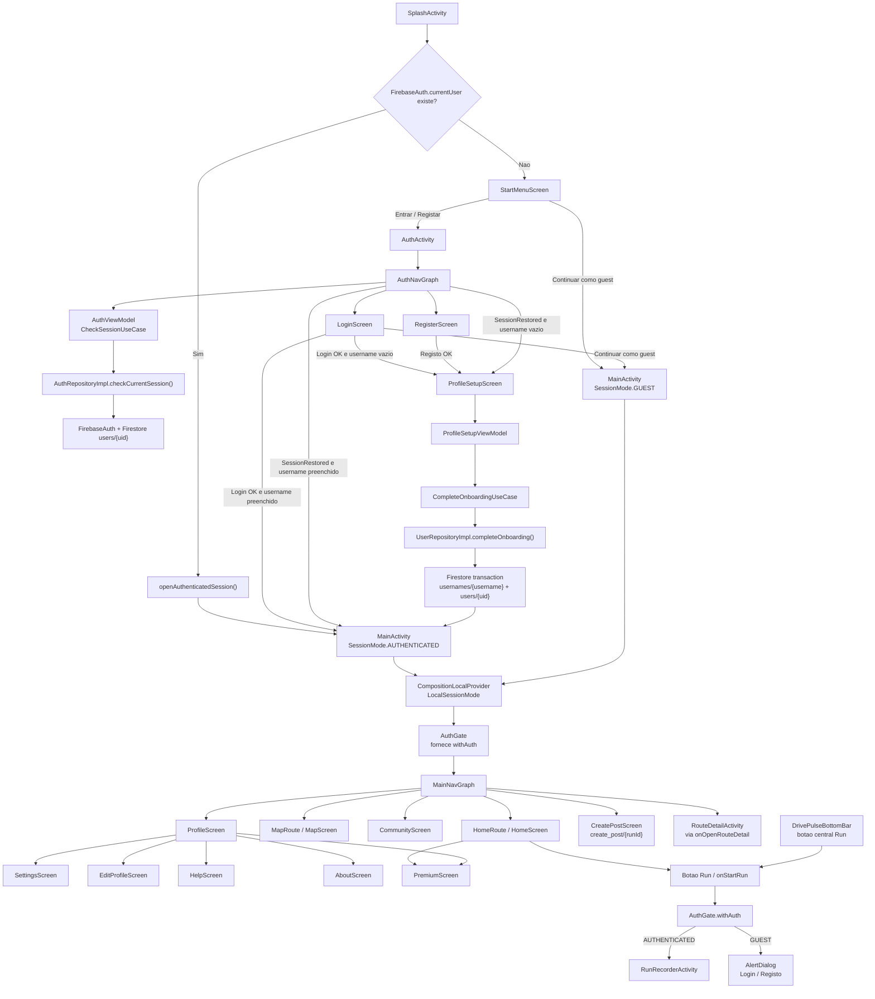
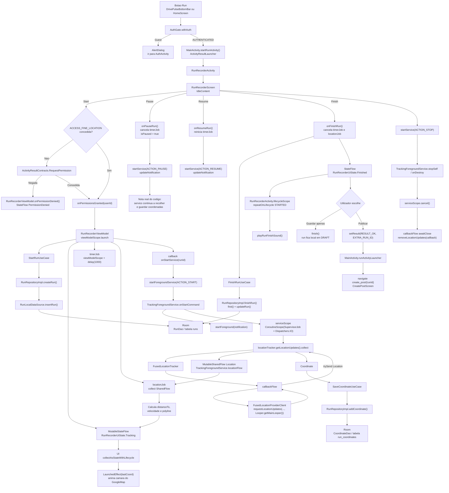
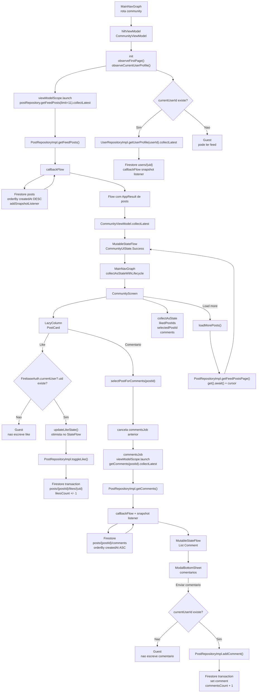
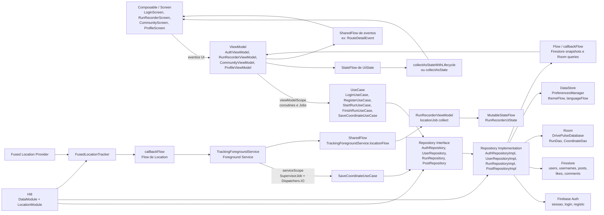

# Computação Móvel - Assignments

Este repositório reúne todos os trabalhos práticos (Assignments) desenvolvidos no âmbito da unidade curricular de **Computação Móvel**. 
A estrutura está concebida para integrar múltiplos Assignments (**A1**, **A2**, ..., **An**), facilitando a navegação e a consulta rápida da documentação, código e configuração para cada projeto e/ou tarefa.

## 📌 Índice de Assignments

* [Assignment 1 (A1)](#assignment-1-a1)
* [Assignment 2 (A2)](#assignment-2-a2)
* [Assignment 3 (A3)](#assignment-3-a3)
* [Assignment 4 (A4)](#assignment-4-a4)
* [Final Project - DrivePulse](#final-project---drivepulse)

---

## Assignment 1 (A1)

Este primeiro bloco de trabalhos foca-se na introdução e consolidação da linguagem **Kotlin**, bem como na aprendizagem dos fundamentos de desenvolvimento nativo para **Android**.

### Índice de Tarefas (A1)
1. [Tarefa 1 – Kotlin Tutorial Exercises](#1-tarefa-1--kotlin-tutorial-exercises)
2. [Hello World V2](#2-hello-world-v2)
3. [Library Management System (Virtual Library)](#3-library-management-system-virtual-library)
4. [Hello World Optional](#4-hello-world-optional)
5. [City Mood Scanner](#5-city-mood-scanner)

---

### 1. Tarefa 1 – Kotlin Tutorial Exercises

**Explicação do Código:**  
A `Tarefa1` agrupa a resolução de 3 exercícios concebidos para introduzir diferentes conceitos-chave de Kotlin:
- **Exer 1:** Centra-se em coleções. Demonstra diferentes formas de inicializar e popular arrays gerando quadrados (de 1^2 até 50^2) com a utilização de lambdas nos construtores `IntArray`, `Array` e as funções `range` em conjunção com `.map()`.
- **Exer 2:** Consiste no desenvolvimento de uma calculadora em Consola. O código utiliza leitura síncrona com `readln()`, valida e processa entradas utilizando de forma expressiva expressões `when`. Trata eventuais problemas através de blocos `try-catch`, isolando exceções como a divisão por zero (`ArithmeticException`) e introduções inválidas (`IllegalArgumentException`).
- **Exer 3:** Trabalha com progressões. Utiliza a função `generateSequence` para emular os ressaltos de um objeto (que perde 40% da altura em cada salto), ilustrando o uso do paradigma funcional com `takeWhile`, `take` e `map`.

**Estrutura de Ficheiros:**
```text
A1/Tarefa1/
└── src/main/kotlin/cm/
    ├── exer_1/exer_1.kt
    ├── exer_2/exer_2.kt
    └── exer_3/exer_3.kt
```

---

### 2. Hello World V2

**Explicação do Código:**  
A `Hello World V2` é uma aplicação Android simples, desenvolvida para demonstrar diferentes conceitos fundamentais e o ciclo de vida da `Activity`.
Na lógica contida na `MainActivity`, o código recorre à biblioteca AndroidX integrando o `enableEdgeToEdge()` e gerindo um `WindowInsetsListener` para adaptar o ecrã permitindo ocultar a system bar, de modo a aproveitar o espaço de "edge a edge". 
No que diz respeito à componente visual gerida em UI/XML, usa centralização de textos (`strings.xml`), estilos e cores predefinidas (`colors.xml`), dispondo Views elementares (tais como `TextView`, `CalendarView` e `ImageView`) dentro de um `ConstraintLayout`. Além disso, possui lógica de resposta a orientações diversificadas possuindo layouts quer para retrato, quer para paisagem (`layout-land`).

**Estrutura de Ficheiros:**
```text
A1/CM/
├── app/src/main/
│   ├── java/cm_a15044/helloworld/
│   │   └── MainActivity.kt
│   └── res/
│       ├── layout/activity_main.xml         (Design vertical)
│       ├── layout-land/activity_main.xml    (Design horizontal)
│       ├── values/strings.xml, colors.xml, themes.xml
│       └── drawable/smile.png
```

---

### 3. Library Management System (Virtual Library)

**Explicação do Código:**  
Este projeto serve como exercício prático nos principais pilares de *Programação Orientada a Objetos* (POO) em Kotlin, onde se simula a gestão de uma biblioteca.
A classe abstrata fundamental `Book` agrega lógica intemporal (como métodos referentes ao ano de publicação e a própria descrição). Através de conceitos de *Inheritance* (herança), a classe divide-se especificamente para dois contextos:
- **PhysicalBook:** Subclasse que aborda questões como número de cópias físicas (que são atualizadas sempre que existe um empréstimo ou devolução), capa rija e peso em kg.
- **DigitalBook:** Subclasse que define características mais próprias deste meio digital como tamanho em MB e as extensões (PDFs e etc.).
A `Library` atua como agregador global e dispõe ainda de um `companion object` útil para o tracking geral de objetos alocados. Por fim, utilizam-se  `data class` na estruturação e agregação de dados relativos aos diferentes Sócios (`LibraryMember`).

**Estrutura de Ficheiros:**
```text
A1/VirtualLibrary/
└── src/main/kotlin/
    ├── Book.kt
    ├── DigitalBook.kt
    ├── PhysicalBook.kt
    ├── Library.kt
    ├── LibraryMember.kt
    └── Main.kt
```

---

### 4. Hello World Optional

**Explicação do Código:**  
Esta aplicação Android foca-se na obtenção programática de metadados inerentes ao dispositivo onde se encontra atualmente em execução, utilizando as diversas flags expostas pela API `Build` do Android.
Na `MainActivity`, todo o processo de levantamento deste perfil (propriedades `Build.BRAND`, `Build.MODEL`, `Build.VERSION.RELEASE`, `Build.VERSION.SDK_INT`, etc.) ocorre no ciclo `onCreate`, compondo depois progressivamente toda a estrutura numa só variável iterável. Para possibilitar ao utilizador acesso universal a toda essa listagem concatenada, no Layout XML injeta-se um `TextView` no interior de um `ScrollView`. O ajuste ao layout com o `ViewCompat` garante que a informação nunca se sobrepõe ou invade as "safe zones".

**Estrutura de Ficheiros:**
```text
A1/helloWorldOptional/
├── app/src/main/
│   ├── java/com/example/helloworldoptional/
│   │   └── MainActivity.kt
│   └── res/
│       ├── layout/activity_main.xml
│       └── values/strings.xml
```

---

### 5. City Mood Scanner

**Explicação do Código:**  
Este é um projeto avançado no âmbito de A1 que se foca em demonstrar o potencial da stack de aplicações Kotlin contemporâneo (Android). O sistema arquitetura-se maioritariamente num padrão *MVVM (Model-View-ViewModel)*.
A `MainActivity` funciona em estrita ligação com o ViewModel (`MapViewModel`), processando intenções através de repositórios como o `EnvironmentRepository` para coordenar acessos sem expor a interface local aos pedidos. Utiliza o `Retrofit` (configurado em `RetrofitClient`) para invocar APIs Web e solicitar dados sobre poluição, geolocalização exata, clima e ruído do respetivo local. As entidades obtidas nos endpoints REST são seguidamente convertidas para Data Classes concretas adaptadas a estas APIs (como `AirQualityResponse`, `WeatherResponse`, etc.).

**Estrutura de Ficheiros:**
```text
A1/CityMoodScanner/
├── app/src/main/
│   ├── java/com/example/citymoodscanner/
│   │   ├── MainActivity.kt
│   │   ├── ui/MapViewModel.kt, UiState.kt
│   │   ├── data/
│   │   │   ├── model/ (ex: AirQualityResponse.kt, EnvironmentData.kt...)
│   │   │   ├── remote/ (ApiServices.kt, RetrofitClient.kt)
│   │   │   └── repository/EnvironmentRepository.kt
```

---

## Assignment 2 (A2)

Este segundo bloco de trabalhos introduz e aprofunda conceitos avançados de **Kotlin** e estende a construção de aplicações nativas em **Android** utilizando arquiteturas e padrões como MVVM e DataBinding.

### Índice de Tarefas (A2)
1. [Section1 - Kotlin Events](#1-section1---kotlin-events)
2. [Section1.2 - Kotlin Cache Generics](#2-section12---kotlin-cache-generics)
3. [Section1.3 - Kotlin DSL Pipeline](#3-section13---kotlin-dsl-pipeline)
4. [Section1.4 - Kotlin Operator Overloading](#4-section14---kotlin-operator-overloading)
5. [Section2 - Cool Weather App](#5-section2---cool-weather-app)
6. [Section3 - Dog Images App](#6-section3---dog-images-app)

---

### 1. Section1 - Kotlin Events

**Explicação do Código:**  
A `Section1-Kotlin` demonstra a modelação de um sistema de Gestão de Eventos orientado a objetos com coleções. O código tira partido de Classes de Dados (`Login`, `Purchase`, `Logout` derivadas da interface genérica/classe abstraída `Event`) para mapear os dados em memória. Utiliza funções de ordem superior (`processEvents`) que iteram sob as coleções dos eventos aplicando processamento personalizado por via de lambdas e manipulação de fluxos (filtragens com `.filter()`).

**Estrutura de Ficheiros:**
```text
A2/Section1-Kotlin/
├── src/main/kotlin/
│   ├── Event.kt
│   └── Main.kt
└── pom.xml
```

---

### 2. Section1.2 - Kotlin Cache Generics

**Explicação do Código:**  
A `Section1_2-Kotlin` tem como foco o uso de **Genéricos (Generics)** aplicados a estruturas de dados personalizadas, em específico numa estrutura de Memória Cache (Chave-Valor) flexível. A classe `Cache<K, V>` demonstra métodos fundamentais de acesso como `getOrPut` (utilizando lambdas de inicialização diferida), mutações dinâmicas através de funções como `transform` e limpezas controladas de memória com operações como `evict()`.

**Estrutura de Ficheiros:**
```text
A2/Section1_2-Kotlin/
├── src/main/kotlin/
│   ├── Cache.kt
│   └── Main.kt
└── pom.xml
```

---

### 3. Section1.3 - Kotlin DSL Pipeline

**Explicação do Código:**  
A `Section1_3-Kotlin` foca-se na elaboração de uma arquitetura limpa de Processamento em Lote (Pipeline) alavancada pela criação de uma **DSL (Domain-Specific Language)** fluida combinada com padrões estendidos baseados em *Builder Pattern*. A função `buildPipeline` constrói encadeamentos com diversas "fases" configuráveis (stages, trimming, filters) que transformam logs e erros. A solução ilustra ainda a gestão avançada de bifurcações e paralelismo estrutural contendo forks dinâmicos de sub-pipelines.

**Estrutura de Ficheiros:**
```text
A2/Section1_3-Kotlin/
├── src/main/kotlin/
│   ├── Main.kt
│   └── Pipeline.kt
└── pom.xml
```

---

### 4. Section1.4 - Kotlin Operator Overloading

**Explicação do Código:**  
A `Section1_4-Kotlin` foi exclusivamente programada para demonstrar **Sobrecarga de Operadores (Operator Overloading)** em Kotlin, estendendo-se através do desenho de Vetores Bi-Dimensionais (`Vec2`). Redefine métodos elementares (utilizando a keyword `operator fun`) simulando comportamentos algébricos diretos: adição (`+`), subtração (`-`), multiplicação escalar (`*`), indexador posicional dinâmico (`a[x]`) e as respetivas rotinas lógicas subjacentes à interface `Comparable` (tais como `<`, `>`).

**Estrutura de Ficheiros:**
```text
A2/Section1_4-Kotlin/
├── src/main/kotlin/
│   ├── Main.kt
│   └── Vec2.kt
└── pom.xml
```

---

### 5. Section2 - Cool Weather App

**Explicação do Código:**  
Este projeto Android constitui uma aplicação meteorológica (`dam_A15044coolweatherapp`) que alavanca vigorosamente a arquitetura **MVVM** suportada de ponta a ponta. Através da `MainActivity`, orquestra o layout visual por intermédio de `DataBinding` observando estados emitidos a partir do seu ViewModel. A app tem particular relevância por tratar variações nativas de modo de ecrã (Dark/Light Mode) com manipulação de tonalidades (*Tint List* combinada com resoluções de sufixo no `getIdentifier`), adaptação fluida com `WindowInsetsListener` (edge-to-edge), e processamento granular de permissões de *Geolocalização* (`Manifest.permission.ACCESS_FINE_LOCATION`) durante o runtime.

**Estrutura de Ficheiros:**
```text
A2/Section2-Android/
└── dam_A15044coolweatherapp/
    └── app/src/main/
        ├── java/com/example/dam_a15044coolweatherapp/
        │   ├── MainActivity.kt
        │   ├── WeatherData.kt
        │   └── WeatherViewModel.kt
        └── res/
            └── layout/activity_main.xml
```

---

### 6. Section3 - Dog Images App

**Explicação do Código:**  
A `Section3-Android` exibe um cenário primário virado para a comunicação síncrona/assíncrona baseada em pedidos HTTP. Enaltece metodologias modernas para consumo de APIs remotas através da biblioteca **Retrofit**, requisitando imagens aleatórias. Todas as entidades extraídas são acomodadas uniformemente em memória sob a alçada de um `ImageRepository` orquestrado num `MainViewModel`. Em termos visuais, a aplicação serve-se de uma `RecyclerView` unida intrinsecamente ao seu `ImageAdapter`, providenciando reações interativas através da gestão de `SwipeRefreshLayout` (pull-to-refresh) e elementos correlacionados.

**Estrutura de Ficheiros:**
```text
A2/Section3-Android/
└── Android/app/src/main/
    ├── java/com/example/section3_android/
    │   ├── MainActivity.kt
    │   ├── adapter/ImageAdapter.kt
    │   ├── api/ (DogApiService.kt, RetrofitClient.kt)
    │   ├── model/ImageItem.kt
    │   ├── repository/ImageRepository.kt
    │   └── viewmodel/MainViewModel.kt
    └── res/
        └── layout/ (activity_main.xml, item_image.xml)
```

---

## Assignment 3 (A3)

Este terceiro bloco de trabalhos foca-se na exploração profunda de metaprogramação através de **Annotation Processors** no ecossistema **Kotlin**, e avança de forma significativa na modernização de aplicações **Android** recorrendo a arquiteturas e paradigmas contemporâneos como **Jetpack Compose** e **StateFlow** para reatividade declarativa.

### Índice de Tarefas (A3)
1. [Greeting Processor Project](#1-greeting-processor-project)
2. [Section3 - Cool Weather App (Compose Refactor)](#2-section3---cool-weather-app-compose-refactor)

---

### 1. Greeting Processor Project

**Explicação do Código:**  
Este projeto constitui uma demonstração prática e robusta de processadores de anotações (*Annotation Processors*) customizados em Kotlin, organizado numa arquitetura modular que compreende três módulos interdependentes:

- **Módulo `annotations`:** Define as anotações `@Greeting` e `@Extract` que atuam como marcadores para elementos de código (especificamente funções) que devem ser processadas em tempo de compilação. Ambas anotações recebem **parâmetros configuráveis** (respetivamente `message` e `regex`) que alimentam a lógica geradora de código.

- **Módulo `processor`:** Implementa dois processadores distintos que herdam de `AbstractProcessor` e registam-se automaticamente com o serviço de compilação através da anotação `@AutoService`:
  - **GreetingProcessor:** Interceita métodos marcados com `@Greeting` e, aproveitando a biblioteca **KotlinPoet**, gera dinamicamente classes *wrapper* de encapsulamento. Estas classes delegam invocações, emitindo a saudação customizável (parametrizada em `message`) antes de executarem a lógica original. A geração ocorre exclusivamente durante a compilação através de **KAPT (Kotlin Annotation Processing Tool)**.
  - **RegexProcessor:** Processa métodos anotados com `@Extract`, gerando classes que estendem (via `superclass`) a classe original. Os métodos gerados aplicam a Expressão Regular instanciada (recebida como parâmetro) a um campo `input` herdado, capturando e retornando o primeiro grupo assinalado.

- **Módulo `app`:** Compreende a aplicação cliente que declara `MyClass` com métodos candidatos a processamento. Após compilação, o KAPT executa os processadores definidos, injetando as classes geradas automaticamente no classpath.

A solução ilustra conceitos avançados: **reflexão em tempo de compilação** (compile-time reflection), **geração de código** (code generation), e o padrão **Service Provider Interface (SPI)** do Java.

**Estrutura de Ficheiros:**
```text
A3/GreetingProcessorProject/
├── annotations/src/main/kotlin/org/example/annotations/
│   ├── Greeting.kt
│   └── Extract.kt
├── processor/src/main/kotlin/org/example/processor/
│   ├── GreetingProcessor.kt
│   └── RegexProcessor.kt
├── app/src/main/kotlin/app/
│   ├── MyClass.kt
│   └── DataProcessorExtractor.kt
├── build.gradle.kts
├── settings.gradle.kts
└── gradle.properties
```

---

### 2. Section3 - Cool Weather App (Compose Refactor)

**Explicação do Código:**  
Esta versão modernizada da aplicação meteorológica constitui uma refatorização completa e integral da abordagem apresentada em A2, migrando integralmente do paradigma imperativo baseado em *XML Layouts* e **DataBinding** para a mais recente arquitetura **Jetpack Compose** com UI declarativa.

A `MainActivity` transforma-se essencialmente num contentor agnóstico, delegando toda a composição visual através de `setContent()` que alimenta uma hierarquia de funções `@Composable`. O sistema UI descentraliza-se em componentes modulares e reutilizáveis (armazenados em `ui/`): `WeatherScreen.kt` atua como orquestrador raíz, enquanto `WeatherCard.kt`, `WeatherRow.kt`, e `CoordinatesCard.kt` encapsulam especificidades de apresentação. A `WeatherMapScreen.kt` oferece ainda funcionalidades de visualização geolocalizada.

A gestão de estado sofre uma transição decisiva: abandona-se completamente o modelo **LiveData** a favor da biblioteca reativa **StateFlow**, garantindo emissão contínua de estados (`WeatherUiState`) que a camada de apresentação observa e sincroniza de forma reativa através do operador `collectAsState()`. O `WeatherViewModel`, herança de `AndroidViewModel`, expõe `_uiState` privado e `uiState` público (transformado através de `asStateFlow()`), permitindo mutações controladas com `update { }`.

A integração com permissões de localização (`Manifest.permission.ACCESS_FINE_LOCATION`) foi modernizada recorrendo a `ActivityResultContracts.RequestMultiplePermissions()` em detrimento de fragmentos obsoletos. O `WeatherApiClient` (em `data/`) continua a orquestrar requisições REST através de **Retrofit**, alimentando o `WeatherViewModel` com dados meteorológicos em tempo real.

A aplicação mantém suporte robusto para múltiplos idiomas (ficheiros em `values-pt/`, `values-night/`) e orientações de ecrã diversificadas (`layout-land/`), garantindo adaptabilidade universal através de **Material Design 3** e ajustes de insets com `WindowInsetsListener`.

**Estrutura de Ficheiros:**
```text
A3/Section3-Android/
└── dam_a15044coolweatherapp/
    └── app/src/main/
        ├── java/com/example/dam_a15044coolweatherapp/
        │   ├── MainActivity.kt
        │   ├── data/
        │   │   ├── WeatherData.kt
        │   │   └── WeatherApiClient.kt
        │   ├── ui/
        │   │   ├── WeatherScreen.kt
        │   │   ├── WeatherCard.kt
        │   │   ├── WeatherRow.kt
        │   │   ├── CoordinatesCard.kt
        │   │   └── WeatherMapScreen.kt
        │   └── viewmodel/
        │       └── WeatherViewModel.kt
        └── res/
            ├── layout/
            ├── layout-land/
            ├── values/
            ├── values-night/
            ├── values-pt/
            ├── drawable/
            ├── mipmap-*/
            └── xml/
```

---

## Assignment 4 (A4)

Este quarto bloco de trabalhos foca-se em três áreas centrais do desenvolvimento móvel moderno: **Kotlin Flows/Coroutines**, integração com **LLMs** através de chamadas HTTP em Kotlin, e utilização de **Firebase** para autenticação e persistência remota de dados.

De acordo com o enunciado extraído do PDF, o objetivo era ganhar experiência prática em código assíncrono (`threads`, `callbacks`, `coroutines`, `flows` e `channels`), configurar chamadas a modelos de linguagem como OpenAI/Gemini/Groq, controlar parâmetros de geração como `temperature` e `maxTokens`, realizar análise de sentimento e aplicar Firebase num projeto Android.

### Índice de Tarefas (A4)
1. [Kotlin Flows e Coroutines](#1-kotlin-flows-e-coroutines)
2. [Acesso a LLMs com Kotlin](#2-acesso-a-llms-com-kotlin)
3. [Firebase - Notes Pro XMLViews](#3-firebase---notes-pro-xmlviews)

---

### 1. Kotlin Flows e Coroutines

**Explicação do Código:**

A pasta `A4/s1` contém a implementação do tutorial oficial **Introduction to Coroutines and Channels**, adaptado para comparar diferentes estratégias de acesso assíncrono à API do GitHub. A aplicação usa uma interface Swing (`ContributorsUI`) que permite escolher variantes de execução e observar o impacto de cada abordagem na responsividade da UI.

O código começa com uma versão bloqueante (`Request1Blocking.kt`), que usa chamadas síncronas de Retrofit com `.execute()` e demonstra porque a UI congela quando o trabalho de rede corre na thread principal. A seguir são implementadas alternativas com thread de background, callbacks e funções `suspend`, permitindo perceber a evolução de um modelo imperativo bloqueante para um modelo assíncrono mais legível e seguro.

A versão com coroutines (`Request4Suspend.kt`) transforma os pedidos HTTP em chamadas suspensas, mantendo um fluxo sequencial de leitura fácil sem bloquear a thread. A versão concorrente (`Request5Concurrent.kt`) usa `coroutineScope`, `async` e `awaitAll()` para lançar pedidos de contribuidores em paralelo, reduzindo o tempo total quando existem vários repositórios. A função `aggregate()` centraliza a consolidação dos resultados, agrupando utilizadores repetidos e somando as contribuições antes de ordenar por ordem decrescente.

Para progresso incremental, `Request6Progress.kt` atualiza a UI à medida que cada repositório é processado. Já `Request7Channels.kt` usa `Channel<List<User>>` para separar produtores e consumidor: cada coroutine produtora envia resultados assim que termina, e a coroutine consumidora agrega e publica o progresso sem esperar pela ordem original dos pedidos. Foi também criada a estrutura `LoadingStateData`/`LoadingStateHolder` com `MutableStateFlow` e `StateFlow`, deixando uma base reativa para representar estados de loading (`isLoading`, `progress`, `message`) de forma observável.

**Porque foi feito assim:**

A sequência das variantes mostra, de forma controlada, os problemas de bloqueio, complexidade e cancelamento que aparecem em código assíncrono tradicional. As coroutines tornam o fluxo mais previsível, os `async` permitem paralelizar trabalho independente, e os `channels` resolvem melhor o caso de progresso incremental porque aceitam resultados assim que estes ficam disponíveis.

**Estrutura de Ficheiros:**
```text
A4/s1/
├── src/
│   ├── contributors/
│   │   ├── Contributors.kt
│   │   ├── ContributorsUI.kt
│   │   ├── GitHubService.kt
│   │   ├── Params.kt
│   │   └── main.kt
│   ├── samples/
│   │   ├── ChannelsSample.kt
│   │   └── ConcurrencySample.kt
│   └── tasks/
│       ├── Aggregation.kt
│       ├── LoadingStateData.kt
│       ├── Request1Blocking.kt
│       ├── Request2Background.kt
│       ├── Request3Callbacks.kt
│       ├── Request4Suspend.kt
│       ├── Request5Concurrent.kt
│       ├── Request6Progress.kt
│       └── Request7Channels.kt
├── test/
│   ├── contributors/
│   ├── samples/
│   └── tasks/
├── Documentacao_Coroutines.md
├── build.gradle
└── settings.gradle
```

**Como executar/verificar:**
```powershell
cd A4\s1
.\gradlew test
.\gradlew run
```

---

### 2. Acesso a LLMs com Kotlin

**Explicação do Código:**

A pasta `A4/AISimpleCalls` contém uma aplicação Kotlin de linha de comandos para comunicar com diferentes fornecedores de LLM através de uma interface comum (`AIAssistant`). A aplicação lê configuração local a partir de `config.properties`, cria a implementação correta através de `AIAssistantFactory` e permite interagir com o modelo num ciclo de perguntas e respostas.

A interface `AIAssistant` concentra o contrato comum: leitura da API key, construção de prompts, chamada HTTP com `OkHttp`, parsing da resposta, configuração de logs e retry com **exponential backoff** quando ocorre rate limit (`HTTP 429`). Também foram adicionadas propriedades configuráveis para `TEMPERATURE` e `MAX_TOKENS`, com valores de fallback (`0.7` e `800`) para evitar falhas quando a configuração não existe ou está inválida.

Foram implementadas variantes para **OpenAI**, **Gemini** e **Groq**. A implementação `AIAssistantGroq` usa o endpoint OpenAI-compatible da Groq, permitindo testar o trabalho com um provider de free tier. As classes `AIAssistantOpenAIClasses.kt` e `AIAssistantGeminiClasses.kt` usam `data class` e `Gson` para estruturar pedidos/respostas JSON de forma mais robusta do que montar strings manualmente.

A análise de sentimento foi implementada em `analyzeSentiment(input: String)`, que força o modelo a responder apenas com JSON contendo `rating` de 1 a 7 e `justification`. O teste `SentimentTest.kt` valida respostas positivas, neutras e negativas, verificando se o JSON é parseável, se contém as chaves esperadas e se a escala devolvida está dentro dos intervalos aceitáveis. O teste `TemperatureTest.kt` compara respostas para o mesmo prompt com temperatura baixa (`0.1`) e alta (`1.8`), demonstrando o efeito prático deste parâmetro na criatividade/variabilidade da resposta.

**Porque foi feito assim:**

A interface comum evita duplicação entre providers e permite trocar de modelo apenas através de configuração. O uso de `Properties`, `Gson` e `OkHttp` mantém a solução simples, explícita e testável. Os testes não tentam comparar texto gerado de forma rígida, porque respostas de LLM são não determinísticas; em vez disso validam propriedades observáveis, como resposta não vazia, JSON válido e rating dentro da escala definida.

**Estrutura de Ficheiros:**
```text
A4/AISimpleCalls/
├── src/main/kotlin/dam/
│   ├── AIAssistant.kt
│   ├── AIAssistantFactory.kt
│   ├── AIAssistantGemini.kt
│   ├── AIAssistantGeminiClasses.kt
│   ├── AIAssistantGroq.kt
│   ├── AIAssistantOpenAI.kt
│   ├── AIAssistantOpenAIClasses.kt
│   ├── Main.kt
│   └── Utils.kt
├── src/test/kotlin/dam/
│   ├── SentimentTest.kt
│   └── TemperatureTest.kt
├── src/main/resources/
│   └── logback.xml
├── commands.txt
├── build.gradle.kts
└── settings.gradle.kts
```

**Configuração esperada (`config.properties` local):**
```properties
OPENAI_API_KEY=your-openai-key
GEMINI_API_KEY=your-gemini-key
GROQ_API_KEY=your-groq-key
AI_LLM=GROQ
LOG_LEVEL=OFF
TEMPERATURE=0.7
MAX_TOKENS=800
```

> O ficheiro `config.properties` é ignorado pelo Git para não expor chaves privadas.

**Como executar/verificar:**
```powershell
cd A4\AISimpleCalls
.\gradlew run
.\gradlew cleanTest test --info
.\gradlew cleanTest test --tests "dam.TemperatureTest" --info
.\gradlew cleanTest test --tests "dam.SentimentTest" --info
```

---

### 3. Firebase - Notes Pro XMLViews

**Explicação do Código:**

A pasta `A4/NotesProXMLViews3` contém uma aplicação Android em Kotlin/Java baseada em **XML Views** para demonstrar autenticação e persistência com Firebase. O projeto integra `FirebaseAuth`, `FirebaseFirestore`, `Firebase Analytics` e o plugin `com.google.gms.google-services`, com configuração através de `google-services.json`.

O fluxo começa em `SplashActivity`, que espera brevemente e decide se o utilizador segue para `LoginActivity` ou para `MainActivity` consoante exista sessão Firebase ativa. Em `CreateAccountActivity`, o utilizador cria uma conta com email/password, os dados são validados localmente, é enviado email de verificação e a sessão é terminada para obrigar à validação. Em `LoginActivity`, o login só permite avançar quando o Firebase autentica o utilizador e o email já está verificado.

A área de notas é composta por `MainActivity` e `NoteDetailsActivity`. A `MainActivity` apresenta a estrutura principal com `RecyclerView`, botão flutuante para criar notas e menu. A criação/edição/remoção de notas fica em `NoteDetailsActivity`, que constrói um objeto `Note` com `title`, `content` e `timestamp` e grava no Firestore. A classe `Utility` centraliza operações reutilizáveis como `showToast()`, formatação de timestamps e obtenção da coleção correta para o utilizador autenticado:

```text
notes/{uid}/my_notes/{noteId}
```

Esta organização garante que cada utilizador trabalha dentro da sua própria subcoleção, evitando misturar notas de contas diferentes.

**Porque foi feito assim:**

O Firebase Authentication resolve o ciclo de conta/login/verificação sem implementar backend próprio. O Firestore dá uma base documental simples para guardar notas por utilizador, e as XML Views mantêm a implementação próxima do tutorial, separando ecrãs em activities claras: splash, login, criação de conta, lista de notas e detalhes da nota.

**Estrutura de Ficheiros:**
```text
A4/NotesProXMLViews3/
├── app/src/main/
│   ├── AndroidManifest.xml
│   ├── java/com/notes/notesproxmlviews/
│   │   ├── SplashActivity.kt
│   │   ├── LoginActivity.kt
│   │   ├── CreateAccountActivity.kt
│   │   ├── MainActivity.kt
│   │   ├── NoteDetailsActivity.kt
│   │   ├── Note.java
│   │   └── Utility.java
│   └── res/
│       ├── layout/
│       │   ├── activity_splash.xml
│       │   ├── activity_login.xml
│       │   ├── activity_create_account.xml
│       │   ├── activity_main.xml
│       │   └── activity_note_details.xml
│       ├── drawable/
│       ├── values/
│       ├── values-night/
│       └── xml/
├── app/google-services.json
├── gradle/libs.versions.toml
├── build.gradle.kts
└── settings.gradle.kts
```

**Como executar/verificar:**
```powershell
cd A4\NotesProXMLViews3
.\gradlew assembleDebug
```

Para executar a app num dispositivo/emulador, é necessário ter o projeto Firebase configurado e o ficheiro `app/google-services.json` válido para o package `notes.pro`.

---

## Final Project - DrivePulse

### 1. Introdução

O DrivePulse é uma aplicação Android nativa desenvolvida em Kotlin, com interface em Jetpack Compose, orientada para uma comunidade automóvel. A aplicação permite autenticação de utilizadores, exploração de um feed social, consulta de mapa, gravação de percursos de condução, publicação de runs, gestão de perfil e acesso a páginas auxiliares como definições, ajuda, premium e about.

O problema principal que a aplicação procura resolver é a falta de uma experiência simples para registar percursos automóveis, consultar estatísticas básicas da condução e partilhar esses percursos numa comunidade. A app combina tracking GPS, persistência local, persistência remota e uma navegação móvel organizada em torno de Home, Mapa, Comunidade, Run e Perfil.

### 2. Objetivos da aplicação

- Autenticação de utilizadores por email/password e Google Sign-In.
- Entrada em modo autenticado ou modo convidado.
- Exploração da app através de navegação principal com bottom navigation.
- Consulta de mapa com Google Maps e marcadores de rotas publicadas.
- Gravação de runs/percursos com localização GPS.
- Cálculo de tempo, distância, velocidade atual e velocidade média.
- Criação e consulta de publicações na comunidade.
- Associação opcional de uma publicação a uma run guardada.
- Gestão de perfil, fotografia, bio e dados do carro.
- Edição de dados do utilizador.
- Definições de tema, idioma, conta, reset de password e logout.
- Páginas de apoio: Ajuda/FAQ, Premium e About.

### 3. Tecnologias utilizadas

| Tecnologia | Utilização no projeto |
|---|---|
| Kotlin | Linguagem principal em `app/src/main/java/com/drivepulse/`. |
| Jetpack Compose | Construção de todos os ecrãs e componentes UI; não foram identificados layouts XML para ecrãs. |
| MVVM | ViewModels em `feature/*` expõem estado por `StateFlow`/estado Compose e recebem eventos da UI. |
| Clean Architecture | Separação em `feature/`, `domain/`, `data/` e `core/`. |
| Repository Pattern | Interfaces em `domain/repository` e implementações em `data/repository`. |
| Hilt | Injeção de dependências com `@HiltAndroidApp`, `@AndroidEntryPoint`, `@HiltViewModel` e módulos em `data/di`. |
| Room | Base de dados local `DrivePulseDatabase` com tabelas `runs` e `run_coordinates`. |
| DataStore | Persistência de preferências em `PreferencesManager`: tema e idioma. |
| Firebase Authentication | Login, registo, Google Sign-In, sessão atual, logout e reset de password. |
| Firebase Firestore | Perfis, usernames, posts, likes e comentários. |
| Google Maps | Mapas em `MapScreen`, `RunRecorderScreen`, `CreatePostScreen` e `RouteDetailActivity`. |
| Serviços de localização Android | `FusedLocationProviderClient`, `LocationCallback`, `callbackFlow` e `TrackingForegroundService`. |
| Coroutines/Flow | `suspend`, `viewModelScope`, `lifecycleScope`, `Flow`, `StateFlow`, `SharedFlow`, `callbackFlow`, `collectLatest` e DataStore Flow. |
| Coil | Carregamento de imagens de perfil/posts, incluindo Base64 convertido em `Constants.getCoilDataModel`. |
| Timber | Logging em debug e em operações assíncronas. |

### 4. Arquitetura geral

A aplicação segue uma organização inspirada em Clean Architecture com MVVM. O fluxo conceptual usado é:

```text
Composable Screen
    -> ViewModel
    -> UseCase
    -> Repository Interface
    -> Repository Implementation
    -> Room / Firebase / DataStore / Location / Maps
```

Papel das camadas:

| Camada | Papel |
|---|---|
| `feature/` | Contém Activities, ecrãs Compose, ViewModels e estados de UI por funcionalidade. |
| `domain/` | Contém modelos de domínio, interfaces de repositories, use cases e validações. Não depende diretamente de Compose, Room ou Firebase. |
| `data/` | Implementa repositories, DTOs, DAOs, Room, DataStore, Firebase e módulos Hilt. |
| `core/` | Contém constantes, modo de sessão, design system, navegação, componentes comuns e localização. |

Exemplos reais:

- `CreatePostScreen` chama `CreatePostViewModel`.
- `CreatePostViewModel` usa `PostRepository`, `RunRepository` e `UserRepository`.
- `PostRepositoryImpl` escreve na collection Firestore `posts`.
- `RunRepositoryImpl` usa `RunLocalDataSource`, que delega nos DAOs Room.
- `TrackingForegroundService` usa `LocationTracker` e `SaveCoordinateUseCase`.

### 5. Estrutura de pastas

Estrutura real encontrada no projeto:

```text
Final_Project/
├── .ai/
├── app/
│   ├── google-services.json
│   ├── build.gradle.kts
│   └── src/
│       ├── main/
│       │   ├── AndroidManifest.xml
│       │   ├── java/com/drivepulse/
│       │   └── res/
│       ├── test/
│       └── androidTest/
├── docs/
├── gradle/
├── handoffs/
├── build.gradle.kts
├── gradle.properties
├── local.properties
├── local.properties.example
├── settings.gradle.kts
└── README.md

Media_Relatorio/
├── About.jfif
├── Community.jfif
├── Create_Post.jfif
├── Edit_Prof.jfif
├── Finish_Run.jfif
├── Help_faq.jfif
├── Home.jfif
├── Init_Run.jfif
├── Launch.jfif
├── Login.jfif
├── Map.jfif
├── Premium_page.jfif
├── Profile.jfif
├── Registo.jfif
├── Run.jfif
└── Settings.jfif
```

Nota: `Media_Relatorio` não está dentro da pasta `Final_Project`; está na pasta irmã `Assignments/Media_Relatorio`. Por isso, a partir deste README, os caminhos relativos corretos usam `Media_Relatorio/...`.

Principais pastas de código:

| Pasta | Conteúdo real |
|---|---|
| `core/common` | `Constants`, `AppResult`, `AppError`, `SessionMode`, `LocalSessionMode` e `AuthGate`. |
| `core/designsystem` | Tema, cores, tipografia, shapes, spacing, botões, cards, bottom bar e top bar. |
| `core/location` | `LocationTracker`, `FusedLocationTracker` e `TrackingForegroundService`. |
| `core/navigation` | `AppDestination`, `BottomNavItem` e `MainNavGraph`. |
| `data/di` | `DataModule` e `LocationModule`. |
| `data/local` | DAOs, database Room, entidades e `RunLocalDataSource`. |
| `data/preferences` | `PreferencesManager`, `AppTheme` e `AppLanguage`. |
| `data/remote` | DTOs Firestore: `UserDto`, `PostDto`, `CommentDto`. |
| `data/remote/datasource` | Pasta existente, mas sem ficheiros identificados no código. |
| `data/remote/model` | Pasta existente, mas sem ficheiros identificados no código. |
| `data/repository` | Implementações `AuthRepositoryImpl`, `UserRepositoryImpl`, `PostRepositoryImpl`, `RunRepositoryImpl`. |
| `domain/model` | `User`, `Post`, `PostPage`, `MediaType`, `Run`, `RunStatus`, `RunStatistics`, `Coordinate`, `Comment`. |
| `domain/repository` | Interfaces de autenticação, utilizador, posts e runs. |
| `domain/usecase` | Use cases de auth, profile e run. |
| `domain/validation` | `CarYearValidator`. |
| `feature/start` | `SplashActivity` e `StartMenuScreen`. |
| `feature/auth` | `AuthActivity`, `AuthNavGraph`, `AuthViewModel`, `LoginScreen`, `RegisterScreen`, `AuthState`. |
| `feature/main` | `MainActivity` e `MainViewModel`. |
| `feature/home` | `HomeScreen`, `HomeRoute` e `HomeViewModel`. |
| `feature/map` | `MapScreen`, `MapRoute` e `MapViewModel`. |
| `feature/run` | `RunRecorderActivity`, `RunRecorderViewModel`, `RunRecorderUiState`, ecrã e componentes. |
| `feature/community` | Feed, estado, ViewModel, `CommunityScreen` e `PostCard`. |
| `feature/createpost` | `CreatePostScreen`, `CreatePostViewModel` e `CreatePostUiState`. |
| `feature/profile` | Perfil, onboarding, edição de perfil, estados e ViewModels. |
| `feature/routedetail` | `RouteDetailActivity`, `RouteDetailViewModel` e estados/eventos. |
| `feature/settings` | Definições e `SettingsViewModel`. |
| `feature/premium` | Ecrã Premium demonstrativo. |
| `feature/help` | Ecrã Ajuda/FAQ. |
| `feature/about` | Ecrã About. |

### 6. Modelos de dados principais

#### User

| Campo | Tipo | Descrição | Origem |
|---|---|---|---|
| `id` | `String` | Identificador do utilizador, normalmente UID Firebase. | Domínio / Firestore DTO |
| `email` | `String` | Email da conta. | Domínio / Firestore DTO / Firebase Auth |
| `username` | `String` | Handle público do utilizador. | Domínio / Firestore DTO |
| `firstName` | `String` | Primeiro nome. | Domínio / Firestore DTO |
| `lastName` | `String` | Último nome. | Domínio / Firestore DTO |
| `displayName` | `String` | Nome de apresentação. | Domínio / Firestore DTO |
| `profileImageUrl` | `String?` | URL ou string Base64 `data:image/jpeg;base64,...` da imagem de perfil. | Domínio / Firestore DTO |
| `selectedCarBrand` | `String` | Marca do carro. | Domínio / Firestore DTO |
| `selectedCarModel` | `String` | Modelo do carro. | Domínio / Firestore DTO |
| `selectedCarYear` | `Int` | Ano do carro. | Domínio / Firestore DTO |
| `bio` | `String` | Biografia curta. | Domínio / Firestore DTO |
| `createdAt` | `Long` | Timestamp de criação. | Domínio / Firestore DTO |
| `updatedAt` | `Long` | Timestamp da última atualização. | Domínio / Firestore DTO |

#### Post

| Campo | Tipo | Descrição | Origem |
|---|---|---|---|
| `id` | `String` | Identificador do post. | Domínio / Firestore DTO |
| `userId` | `String` | ID do autor. | Domínio / Firestore DTO |
| `username` | `String` | Username denormalizado do autor. | Domínio / Firestore DTO |
| `userProfileImage` | `String?` | Avatar denormalizado do autor. | Domínio / Firestore DTO |
| `description` | `String` | Texto da publicação. | Domínio / Firestore DTO |
| `runId` | `String?` | ID da run associada, ou `null` para post normal. | Domínio / Firestore DTO |
| `distanceMeters` | `Float` | Distância da run associada. | Domínio / Firestore DTO |
| `durationSeconds` | `Long` | Duração da run associada. | Domínio / Firestore DTO |
| `avgSpeedKmh` | `Float` | Velocidade média. | Domínio / Firestore DTO |
| `runCoordinates` | `List<Coordinate>` | Coordenadas usadas para preview/polyline. | Domínio / Firestore DTO |
| `mediaUrl` | `String?` | Imagem Base64 ou URL. No código atual é Base64 quando há imagem. | Domínio / Firestore DTO |
| `mediaType` | `MediaType?` | `IMAGE` ou `VIDEO`; a seleção atual usa imagem. | Domínio / Firestore DTO |
| `tags` | `List<String>` | Tags selecionadas na criação do post. | Domínio / Firestore DTO |
| `likesCount` | `Int` | Contador denormalizado de likes. | Domínio / Firestore DTO |
| `commentsCount` | `Int` | Contador denormalizado de comentários. | Domínio / Firestore DTO |
| `createdAt` | `Long` | Timestamp de criação. | Domínio / Firestore DTO |

#### PostPage

| Campo | Tipo | Descrição | Origem |
|---|---|---|---|
| `posts` | `List<Post>` | Lista de posts da página. | Domínio |
| `nextCursor` | `String?` | Cursor para paginação por post ID. | Domínio |

#### MediaType

| Valor | Descrição | Origem |
|---|---|---|
| `IMAGE` | Imagem associada à publicação. | Domínio / Firestore DTO |
| `VIDEO` | Tipo previsto no enum, mas seleção/publicação de vídeo não foi identificada no código. | Domínio / Firestore DTO |

#### Run

| Campo | Tipo | Descrição | Origem |
|---|---|---|---|
| `id` | `String` | UUID da run. | Domínio / Room |
| `userId` | `String` | ID do utilizador dono da run. | Domínio / Room |
| `title` | `String` | Título gerado da run. | Domínio / Room |
| `startTime` | `Long` | Início da gravação. | Domínio / Room |
| `endTime` | `Long?` | Fim da gravação. | Domínio / Room |
| `durationSeconds` | `Long` | Duração total em segundos. | Domínio / Room |
| `distanceMeters` | `Float` | Distância total em metros. | Domínio / Room |
| `avgSpeedKmh` | `Float` | Velocidade média. | Domínio / Room |
| `status` | `RunStatus` | `DRAFT`, `PUBLISHED` ou `DISCARDED`. No fluxo atual a run finalizada fica `DRAFT`. | Domínio / Room |
| `coordinates` | `List<Coordinate>` | Coordenadas da run. | Domínio / Room |

#### RunStatus

| Valor | Descrição | Origem |
|---|---|---|
| `DRAFT` | Run guardada localmente e ainda não publicada. | Domínio / Room |
| `PUBLISHED` | Estado previsto, mas atualização para `PUBLISHED` não foi identificada no código atual. | Domínio / Room |
| `DISCARDED` | Estado previsto, mas fluxo explícito de descarte não foi identificado no código atual. | Domínio / Room |

#### RunStatistics

| Campo | Tipo | Descrição | Origem |
|---|---|---|---|
| `totalRuns` | `Int` | Número total de runs. | Domínio / Room projection |
| `totalDistanceMeters` | `Double` | Distância total agregada. | Domínio / Room projection |
| `totalDurationSeconds` | `Long` | Duração total agregada. | Domínio / Room projection |

#### Coordinate

| Campo | Tipo | Descrição | Origem |
|---|---|---|---|
| `latitude` | `Double` | Latitude WGS84. | Domínio / Room / Firestore DTO embutido em `PostDto` |
| `longitude` | `Double` | Longitude WGS84. | Domínio / Room / Firestore DTO embutido em `PostDto` |
| `altitude` | `Double` | Altitude. | Domínio / Room / Firestore DTO embutido em `PostDto` |
| `speed` | `Float` | Velocidade instantânea em m/s. | Domínio / Room / Firestore DTO embutido em `PostDto` |
| `timestamp` | `Long` | Timestamp da localização. | Domínio / Room / Firestore DTO embutido em `PostDto` |

#### Comment

| Campo | Tipo | Descrição | Origem |
|---|---|---|---|
| `id` | `String` | ID do comentário. | Domínio / Firestore DTO |
| `postId` | `String` | ID do post comentado. | Domínio / Firestore DTO |
| `userId` | `String` | ID do autor. | Domínio / Firestore DTO |
| `username` | `String` | Username denormalizado. | Domínio / Firestore DTO |
| `userProfileImage` | `String?` | Avatar denormalizado. | Domínio / Firestore DTO |
| `text` | `String` | Texto do comentário. | Domínio / Firestore DTO |
| `createdAt` | `Long` | Timestamp de criação. | Domínio / Firestore DTO |

#### RunEntity

| Campo | Tipo | Descrição | Origem |
|---|---|---|---|
| `id` | `String` | Chave primária da tabela `runs`. | Room |
| `userId` | `String` | Dono da run. | Room |
| `title` | `String` | Título da run. | Room |
| `startTime` | `Long` | Início. | Room |
| `endTime` | `Long?` | Fim. | Room |
| `durationSeconds` | `Long` | Duração. | Room |
| `distanceMeters` | `Float` | Distância. | Room |
| `avgSpeedKmh` | `Float` | Velocidade média. | Room |
| `status` | `String` | Estado guardado como string. | Room |
| `createdAt` | `Long` | Timestamp para ordenação. | Room |

#### CoordinateEntity

| Campo | Tipo | Descrição | Origem |
|---|---|---|---|
| `id` | `Long` | Chave primária auto-gerada. | Room |
| `runId` | `String` | Foreign key para `RunEntity.id`. | Room |
| `latitude` | `Double` | Latitude. | Room |
| `longitude` | `Double` | Longitude. | Room |
| `altitude` | `Double` | Altitude. | Room |
| `speed` | `Float` | Velocidade instantânea. | Room |
| `timestamp` | `Long` | Timestamp da coordenada. | Room |

#### Route / Car Profile

| Modelo | Estado |
|---|---|
| `Route` | Não identificado no código como modelo independente. O detalhe de rota usa `Post` com `runCoordinates`. |
| `CarProfile` | Não identificado no código como classe independente. Os dados do carro estão em `User`: `selectedCarBrand`, `selectedCarModel`, `selectedCarYear`. |

### 7. Navegação da aplicação

| Rota / Screen | Origem | Destinos possíveis | Requer login? | ViewModel associado | Observações |
|---|---|---|---|---|---|
| `SplashActivity` / Start | Abertura da app | `AuthActivity`, `MainActivity` autenticado, `MainActivity` guest | Não | Não identificado | Verifica `FirebaseAuth.currentUser`; se existir sessão abre Main autenticado. |
| `login` | `AuthActivity` | `register`, `setup`, `MainActivity`, guest | Não | `AuthViewModel` | Login email/password e Google; também permite continuar como convidado. |
| `register` | Login | `setup`, Login | Não | `AuthViewModel` | Registo cria conta Firebase e encaminha para onboarding. |
| `setup` | Login/registo/sessão restaurada sem username | `MainActivity`, Login | Sim | `ProfileSetupViewModel` | Completa username, nome e dados do carro. |
| `home` | `MainActivity` | `map`, `community`, `premium`, `RunRecorderActivity` | Não para abrir; Run exige login | `HomeViewModel` | Start destination do `MainNavGraph`. |
| `map` | Bottom navigation / Home | `RouteDetailActivity` | Não | `MapViewModel` | Mostra pins de posts com coordenadas. |
| `community` | Bottom navigation / Home | `RouteDetailActivity`, comentários | Não para ver; like/comentário exigem utilizador autenticado no código | `CommunityViewModel` | Feed Firestore com paginação e modal de comentários. |
| `profile` | Bottom navigation | `edit_profile`, `settings`, `help`, `about`, `premium` | Sim para dados úteis | `ProfileViewModel` | Em guest, o ViewModel emite erro de utilizador não autenticado. |
| `edit_profile` | Perfil | Voltar ao perfil | Sim | `ProfileViewModel` | Edita foto, nome, bio e carro. |
| `settings` | Perfil | Auth após logout, voltar | Sim | `SettingsViewModel` | Tema, idioma, reset de password, logout. |
| `help` | Perfil | Voltar | Não | Não aplicável | FAQ estático. |
| `about` | Perfil | Voltar | Não | Não aplicável | Informação sobre app/autor/contexto académico. |
| `premium` | Home / Perfil | Voltar | Não | Não aplicável | Subscrição simulada no estado local do ecrã. |
| `create_post/{runId}` | Resultado de `RunRecorderActivity` | Voltar / feed por snapshot | Sim | `CreatePostViewModel` | Carrega a run local por `runId` e publica em Firestore. |
| `RunRecorderActivity` | Botão central Run / Home | `create_post/{runId}` ou voltar | Sim | `RunRecorderViewModel` | Pede localização, inicia foreground service e devolve `EXTRA_RUN_ID` se publicar. |
| `RouteDetailActivity` | Map, Community, Profile | Voltar com resultado de like | Não para ver; like exige auth | `RouteDetailViewModel` | Mostra mapa, estatísticas, imagem e like. |

### 8. Fluxos funcionais completos da app

#### 8.1 Fluxo de entrada na app

```text
Launch / SplashActivity
 -> verificar FirebaseAuth.currentUser
    -> utilizador autenticado: MainActivity com SessionMode.AUTHENTICATED
    -> utilizador não autenticado: StartMenuScreen
        -> Entrar / Registar: AuthActivity
        -> Explorar como convidado: MainActivity com SessionMode.GUEST

AuthActivity / AuthNavGraph
 -> AuthViewModel.checkSession()
    -> sessão restaurada com username: MainActivity autenticado
    -> sessão restaurada sem username: setup
    -> sem sessão: login
```

O modo guest existe e é propagado por `LocalSessionMode`. Ações protegidas, como iniciar uma run, passam por `AuthGate`.

#### 8.2 Fluxo de login

1. Utilizador abre `LoginScreen`.
2. Preenche email e password.
3. `AuthViewModel.validateInputs` verifica campos vazios, formato de email e password com pelo menos 6 caracteres.
4. `LoginUseCase` chama `AuthRepository.login`.
5. `AuthRepositoryImpl` usa `FirebaseAuth.signInWithEmailAndPassword(...).await()`.
6. Após sucesso, `ensureUserDocumentAndGetProfile` lê/cria `users/{uid}` em Firestore.
7. Se o utilizador tiver `username`, navega para `MainActivity` autenticado.
8. Se o `username` estiver vazio, navega para `setup`.
9. Em erro, `AuthState.Error` mostra mensagem.

Login Google:

1. `LoginScreen` usa `CredentialManager` e `GetSignInWithGoogleOption`.
2. Recebe ID token.
3. `AuthViewModel.googleSignIn` chama `GoogleSignInUseCase`.
4. `AuthRepositoryImpl.signInWithGoogle` usa `FirebaseAuth.signInWithCredential`.
5. O resto do fluxo é igual ao login normal.

#### 8.3 Fluxo de registo

1. Utilizador abre `RegisterScreen`.
2. Preenche email, password e confirmação.
3. `AuthViewModel.register` valida campos, email, password mínima e confirmação.
4. `RegisterUseCase` chama `AuthRepository.register`.
5. `AuthRepositoryImpl` usa `FirebaseAuth.createUserWithEmailAndPassword(...).await()`.
6. É criado/lido o documento `users/{uid}` com `username` vazio.
7. O fluxo segue para `ProfileSetupScreen`.
8. O utilizador escolhe username, nome, apelido, marca, modelo e ano do carro.
9. `ProfileSetupViewModel` verifica disponibilidade do username com debounce.
10. `CompleteOnboardingUseCase` valida dados e chama `UserRepository.completeOnboarding`.
11. `UserRepositoryImpl` usa transação Firestore para reservar `usernames/{username}` e atualizar `users/{uid}`.
12. Em sucesso, navega para `MainActivity` autenticado.
13. Em erro, fica em `OnboardingUiState.Error`.

#### 8.4 Fluxo de Home

`HomeViewModel` observa `AuthRepository.observeAuthState`. Quando há utilizador autenticado:

- carrega o perfil via `UserRepository.getUserProfile`;
- carrega posts do utilizador via `PostRepository.getUserPosts`;
- filtra posts com `runId != null`;
- ordena por `createdAt` e mostra até 5 runs recentes.

Quando não há utilizador autenticado, o perfil fica `null` e a lista de posts fica vazia. A Home permite iniciar run, ir ao mapa, ir à comunidade e abrir Premium.

#### 8.5 Fluxo de mapa

1. `MapViewModel` observa o feed via `PostRepository.getFeedPosts`.
2. `MapScreen` cria um `GoogleMap`.
3. Se a app já tiver `ACCESS_FINE_LOCATION` ou `ACCESS_COARSE_LOCATION`, ativa `isMyLocationEnabled`.
4. Para cada `Post` com `runCoordinates`, cria um marcador na primeira coordenada.
5. Ao tocar no marcador, abre `RouteDetailActivity`.

Comportamento se a permissão for recusada ou nunca pedida: o mapa continua a abrir, mas a localização atual não é ativada. O ecrã de mapa não pede permissões em runtime; o pedido de permissão foi identificado no fluxo de run.

#### 8.6 Fluxo de run/tracking

1. Utilizador toca no botão central Run.
2. `AuthGate` bloqueia convidados e mostra diálogo para login/registo.
3. Em sessão autenticada, `MainActivity` lança `RunRecorderActivity`.
4. `RunRecorderActivity` mostra `RunRecorderScreen` em estado `Idle`.
5. Ao iniciar, verifica `ACCESS_FINE_LOCATION`.
6. Se não existir permissão, usa `ActivityResultContracts.RequestPermission`.
7. Se a permissão for recusada, chama `viewModel.onPermissionDenied()` e mostra `PermissionDenied`.
8. Se a permissão for concedida, obtém `firebaseAuth.currentUser?.uid` ou `"guest"` como fallback.
9. `RunRecorderViewModel.onPermissionsGranted` chama `StartRunUseCase`.
10. `RunRepositoryImpl.createRun` cria uma `RunEntity` local em Room com estado `DRAFT`.
11. `RunRecorderActivity` inicia `TrackingForegroundService` com `ACTION_START` e `EXTRA_RUN_ID`.
12. `TrackingForegroundService` chama `startForeground` com notificação persistente.
13. O serviço recolhe localizações através de `FusedLocationTracker.getLocationUpdates`.
14. `FusedLocationTracker` converte `LocationCallback` em `Flow<Location>` com `callbackFlow`.
15. Cada localização é emitida no `SharedFlow` estático `TrackingForegroundService.locationFlow`.
16. Cada localização também é guardada em Room através de `SaveCoordinateUseCase`.
17. `RunRecorderViewModel` recolhe `locationFlow`, calcula distância incremental com `Location.distanceTo`, velocidade atual e lista de coordenadas para a UI.
18. O cronómetro é mantido por uma coroutine com `delay(1_000L)`.
19. A UI atualiza mapa, polyline, distância, tempo e velocidade.
20. Pausar cancela o timer e marca `isPaused = true`; retomar reinicia o timer.
21. Finalizar cancela jobs, chama `FinishRunUseCase`, calcula velocidade média e atualiza a run local.
22. Ao terminar, a Activity para o serviço.

Limitação identificada: durante pausa, o ViewModel ignora localizações para o HUD, mas o `TrackingForegroundService` continua a guardar coordenadas no Room. Isto está assinalado como limitação conhecida.

#### 8.7 Fluxo de finalização de run

Depois de `onFinishRun`, o estado passa para `RunRecorderUiState.Finished` com:

- `runId`;
- `durationSeconds`;
- `distanceMeters`;
- `avgSpeedKmh`.

Opções disponíveis:

| Opção | Comportamento |
|---|---|
| Publicar no feed | `RunRecorderActivity` devolve `RESULT_OK` com `EXTRA_RUN_ID`; `MainActivity` navega para `create_post/{runId}`. |
| Guardar apenas | Fecha a Activity sem `RESULT_OK`; a run fica guardada localmente em Room como `DRAFT`. |
| Cancelar/descartar | Fluxo explícito de descarte não identificado no código. |

#### 8.8 Fluxo de criação de publicação

1. `CreatePostScreen` recebe `runId`.
2. `CreatePostViewModel` carrega a run local com `RunRepository.getRunById(runId).firstOrNull()`.
3. Se existir run, mostra mapa preview, distância, duração e velocidade média.
4. Utilizador escreve descrição.
5. Pode escolher uma fotografia da galeria com `ActivityResultContracts.GetContent`.
6. Pode selecionar tags: `gym`, `cruise`, `hotlap`, `trip`, `touge`, `trackday`, `mountain`, `city`, `highway`, `event`, `training`, `spot`, `night`.
7. Ao publicar, o ViewModel obtém `FirebaseAuth.currentUser`; se for `null`, a função retorna sem publicar.
8. Obtém o perfil do utilizador para denormalizar `username` e `profileImageUrl`.
9. Constrói um `Post` com `UUID`.
10. `PostRepositoryImpl.createPost` comprime imagem, se existir, e guarda Base64 em `mediaUrl`.
11. O post é escrito em `posts/{postId}`.
12. `isPublished = true` faz a UI voltar ao ecrã anterior.
13. O feed é atualizado por listeners Firestore.

Validações de conteúdo: não foi identificada validação obrigatória para descrição não vazia. Imagem e tags são opcionais. Vídeo existe no enum `MediaType`, mas seleção/upload de vídeo não foi identificado no código.

#### 8.9 Fluxo da comunidade

1. `CommunityViewModel` começa em `CommunityUiState.Loading`.
2. Observa a primeira página do feed com `PostRepository.getFeedPosts(limit = 11)`.
3. Mostra até 10 posts e calcula `hasMore`.
4. Estado vazio mostra mensagem neutra quando não existem posts.
5. Estado de erro mostra mensagem e botão `retry`.
6. `loadMorePosts` usa `getFeedPostsPage(pageSize = 10, afterPostId = cursor)`.
7. Likes são otimistas: a UI atualiza antes da transação Firestore e reverte se falhar.
8. Comentários abrem num `ModalBottomSheet`.
9. `selectPostForComments` observa `posts/{postId}/comments`.
10. `addComment` ignora texto em branco.
11. Ao tocar num post, abre `RouteDetailActivity`.

Em modo guest, `currentUserId` é `null`; like e comentário retornam sem operação. O feed continua visível.

#### 8.10 Fluxo de perfil

1. `ProfileViewModel` observa `AuthRepository.observeAuthState`.
2. Se não existir utilizador autenticado, emite erro `"User not authenticated"`.
3. Se existir utilizador:
   - observa perfil em Firestore;
   - observa posts do utilizador;
   - observa estatísticas de runs locais;
   - observa runs locais concluídas.
4. O ecrã mostra avatar, display name, username, bio, carro, estatísticas, histórico de runs e publicações.
5. Se não existirem runs, mostra mensagem de histórico vazio.
6. Se não existirem posts, mostra mensagem neutra de sem publicações.
7. Erros de posts mostram mensagem e botão retry.
8. A partir do perfil é possível abrir edição de perfil, definições, ajuda, about e premium.

#### 8.11 Fluxo de edição de perfil

Campos editáveis identificados:

- fotografia de perfil;
- `displayName`;
- `bio`;
- `selectedCarBrand`;
- `selectedCarModel`;
- `selectedCarYear`.

Fluxo:

1. `EditProfileScreen` usa o estado de `ProfileViewModel`.
2. Se o perfil ainda não estiver em sucesso, mostra loading.
3. A fotografia é selecionada com `ActivityResultContracts.GetContent("image/*")`.
4. `ProfileViewModel.uploadImage` chama `UploadProfileImageUseCase`.
5. `UserRepositoryImpl.uploadProfileImage` comprime a imagem e atualiza `profileImageUrl` em `users/{uid}`.
6. Ao guardar texto/dados do carro, `UpdateUserProfileUseCase` valida o ano do carro se houver dados do carro.
7. `UserRepositoryImpl.updateUserProfile` escreve o `UserDto` em `users/{uid}`.
8. Em sucesso, volta ao perfil.
9. Em erro, mostra mensagem `error_updating_profile`.

#### 8.12 Fluxo de definições

1. `SettingsViewModel` expõe `currentTheme` e `currentLanguage` como `StateFlow`.
2. `SettingsScreen` recolhe estes valores com `collectAsState`.
3. Tema possível: `LIGHT`, `DARK`, `SYSTEM`.
4. Idioma possível: `PT`, `EN`, `ES`.
5. Alterações são persistidas em DataStore.
6. Tema é aplicado com `AppCompatDelegate.setDefaultNightMode`.
7. Idioma é aplicado com `AppCompatDelegate.setApplicationLocales`.
8. Reset de password usa `FirebaseAuth.sendPasswordResetEmail`.
9. Logout chama `LogoutUseCase`, que chama `FirebaseAuth.signOut`.

#### 8.13 Fluxo Premium

O ecrã Premium existe como demonstração académica. Mostra plano mensal de 1 euro/mês, benefícios e botão de subscrição. Ao tocar no botão:

- `isSubscriptionActive` passa a `true`;
- é mostrada uma snackbar de confirmação;
- não existe pagamento real;
- não existe persistência remota/local da subscrição;
- não foi identificado ecrã real de eventos/runs em grupo.

#### 8.14 Fluxo Ajuda/FAQ

`HelpScreen` apresenta três perguntas frequentes:

- como gravar uma run;
- o que é o Premium;
- como mudar a fotografia de perfil.

É um ecrã estático com texto vindo de `strings.xml`.

#### 8.15 Fluxo About

`AboutScreen` mostra:

- nome da app;
- descrição da app;
- fotografia local `R.drawable.foto_perfil`;
- autor;
- contexto académico.

Não há ViewModel associado.

#### 8.16 Fluxos de erro e exceção

| Situação | Tratamento identificado |
|---|---|
| Sem internet | Firebase Auth/Firestore devolvem exceções mapeadas para `AppResult.Error` ou estados `Error`. Não há modo offline remoto identificado. |
| Sem permissões de localização | `RunRecorderActivity` chama `onPermissionDenied` e mostra estado `PermissionDenied`. |
| Firebase indisponível | Repositories devolvem `AppResult.Error` com mensagem da exceção. |
| Erro ao carregar posts | `CommunityUiState.Error` ou `ProfilePostsUiState.Error`; existe retry. |
| Utilizador novo sem posts | `ProfileScreen` mostra mensagem neutra de sem publicações; Community mostra feed vazio. |
| Localização indisponível | Tratamento explícito de provider indisponível não identificado; erros genéricos podem cair em `RunRecorderUiState.Error`. |
| Run sem coordenadas | Create Post não mostra mapa preview; Route Detail mostra mensagem de mapa indisponível. |
| Dados inválidos | Auth/onboarding/profile validam email, password, username, nomes, carro e ano. |
| Cursor de paginação inexistente | `PostRepositoryImpl` devolve `AppResult.Error("Pagination cursor not found")`. |
| Índice Firestore em falta para posts do utilizador | Existe fallback sem índice composto em `getUserPosts`/`getUserPostsPageWithoutCompositeIndex`. |

### 9. Walkthrough visual da aplicação

| Passo | Ecrã / funcionalidade | Descrição | Imagem |
|---:|---|---|---|
| 1 | Launch | Entrada inicial da aplicação e decisão entre sessão existente, autenticação ou modo convidado. |  |
| 2 | Login | Formulário de entrada com email/password, Google Sign-In e opção guest. |  |
| 3 | Registo | Criação de conta antes do onboarding de perfil. |  |
| 4 | Home | Ecrã inicial com saudação, última run, atalhos e acesso ao Premium. |  |
| 5 | Mapa | Consulta de rotas publicadas com marcadores no Google Maps. |  |
| 6 | Início de run | Estado inicial do gravador antes de começar o tracking. |  |
| 7 | Run ativa | Tracking com mapa, polyline, distância, tempo, velocidade e controlos. |  |
| 8 | Finalização de run | Resumo da run guardada localmente e opções de publicar ou guardar apenas. |  |
| 9 | Criar publicação | Publicação associada a run, com descrição, tags e fotografia opcional. |  |
| 10 | Comunidade | Feed social com posts, likes, comentários e rotas partilhadas. |  |
| 11 | Perfil | Perfil do utilizador com estatísticas, runs guardadas e posts. |  |
| 12 | Editar perfil | Edição de imagem, nome, bio e dados do carro. |  |
| 13 | Definições | Tema, idioma, conta, reset de password e logout. |  |
| 14 | Premium | Ecrã demonstrativo da subscrição Premium. |  |
| 15 | Ajuda/FAQ | Perguntas frequentes sobre gravação, Premium e perfil. |  |
| 16 | About | Informação da app, autor e contexto académico. |  |

### 10. Endpoints, serviços e operações de dados

A app não usa uma API REST clássica. As operações externas/persistentes são feitas com Firebase Auth, Firestore, Room, DataStore, Google Maps e Location Services.

| Área | Serviço | Operação | Entrada | Saída | Local no código |
|---|---|---|---|---|---|
| Auth | Firebase Authentication | Login email/password | Email, password | `User` ou `AppResult.Error` | `AuthRepositoryImpl.login` |
| Auth | Firebase Authentication | Registo email/password | Email, password | `User` ou erro | `AuthRepositoryImpl.register` |
| Auth | Firebase Authentication | Google Sign-In | ID token | `User` ou erro | `AuthRepositoryImpl.signInWithGoogle` |
| Auth | Firebase Authentication | Verificar sessão atual | Sessão Firebase | `User?` | `AuthRepositoryImpl.checkCurrentSession` |
| Auth | Firebase Authentication | Observar sessão | Auth listener | `Flow<User?>` | `AuthRepositoryImpl.observeAuthState` |
| Auth | Firebase Authentication | Logout | Sessão atual | Sem retorno | `AuthRepositoryImpl.logout`, `LogoutUseCase` |
| Auth | Firebase Authentication | Reset de password | Email do utilizador atual | Callback sucesso/erro | `SettingsViewModel.sendPasswordReset` |
| Perfil | Firestore | Criar/garantir utilizador | `FirebaseUser` | Documento `users/{uid}` | `AuthRepositoryImpl.ensureUserDocumentAndGetProfile` |
| Perfil | Firestore | Obter perfil | `userId` | `Flow<AppResult<User>>` | `UserRepositoryImpl.getUserProfile` |
| Perfil | Firestore | Atualizar perfil | `User` | `AppResult<Unit>` | `UserRepositoryImpl.updateUserProfile` |
| Perfil | Firestore | Atualizar imagem de perfil | `userId`, bytes de imagem | Base64 string | `UserRepositoryImpl.uploadProfileImage` |
| Perfil | Firestore | Verificar username | Username normalizado | `Boolean` | `UserRepositoryImpl.isUsernameAvailable` |
| Perfil | Firestore Transaction | Completar onboarding | Username, nome, carro | Reserva username e atualiza user | `UserRepositoryImpl.completeOnboarding` |
| Posts | Firestore | Obter feed em tempo real | Limite opcional | `Flow<AppResult<List<Post>>>` | `PostRepositoryImpl.getFeedPosts` |
| Posts | Firestore | Obter posts do utilizador | `userId`, limite opcional | `Flow<AppResult<List<Post>>>` | `PostRepositoryImpl.getUserPosts` |
| Posts | Firestore | Paginar feed | `pageSize`, `afterPostId` | `PostPage` | `PostRepositoryImpl.getFeedPostsPage` |
| Posts | Firestore | Paginar posts do utilizador | `userId`, `pageSize`, cursor | `PostPage` | `PostRepositoryImpl.getUserPostsPage` |
| Posts | Firestore | Obter post | `postId` | `Post` | `PostRepositoryImpl.getPost` |
| Posts | Firestore | Criar post | `Post`, imagem opcional | `AppResult<Unit>` | `PostRepositoryImpl.createPost` |
| Posts | Firestore Transaction | Toggle like | `postId`, `userId` | Atualiza `likes` e `likesCount` | `PostRepositoryImpl.toggleLike` |
| Comentários | Firestore Transaction | Adicionar comentário | `postId`, user, texto | Atualiza `comments` e `commentsCount` | `PostRepositoryImpl.addComment` |
| Comentários | Firestore | Obter comentários | `postId` | `Flow<AppResult<List<Comment>>>` | `PostRepositoryImpl.getComments` |
| Likes | Firestore | Verificar like | `postId`, `userId` | `Boolean` | `PostRepositoryImpl.checkHasLiked` |
| Runs | Room | Inserir run | `RunEntity` | Sem retorno | `RunDao.insertRun`, `RunRepositoryImpl.createRun` |
| Runs | Room | Atualizar run | `RunEntity` | Sem retorno | `RunDao.updateRun`, `RunRepositoryImpl.finishRun` |
| Runs | Room | Obter run | `runId` | `Flow<Run?>` | `RunRepositoryImpl.getRunById` |
| Runs | Room | Obter runs recentes | `userId`, limite | `Flow<List<Run>>` | `RunRepositoryImpl.getRecentCompletedRuns` |
| Runs | Room | Estatísticas agregadas | `userId` | `Flow<RunStatistics>` | `RunRepositoryImpl.getRunStatistics` |
| Coordenadas | Room | Inserir coordenada | `CoordinateEntity` | Sem retorno | `CoordinateDao.insertCoordinate` |
| Coordenadas | Room | Obter coordenadas da run | `runId` | `Flow<List<CoordinateEntity>>` | `CoordinateDao.getCoordinatesForRun` |
| Preferências | DataStore | Ler tema | `KEY_THEME` | `Flow<AppTheme>` | `PreferencesManager.themeFlow` |
| Preferências | DataStore | Guardar tema | `AppTheme` | Persistência local | `PreferencesManager.setTheme` |
| Preferências | DataStore | Ler idioma | `KEY_LANGUAGE` | `Flow<AppLanguage>` | `PreferencesManager.languageFlow` |
| Preferências | DataStore | Guardar idioma | `AppLanguage` | Persistência local | `PreferencesManager.setLanguage` |
| Mapa | Google Maps SDK | Renderizar mapa | API key, estado do mapa | Mapa Compose | `MapScreen`, `RunRecorderScreen`, `CreatePostScreen`, `RouteDetailActivity` |
| Localização | Fused Location Provider | Atualizações GPS | Permissão localização | `Flow<Location>` | `FusedLocationTracker.getLocationUpdates` |
| Segundo plano | Android Foreground Service | Tracking persistente | `ACTION_START`, `runId` | Notificação e coordenadas | `TrackingForegroundService` |

Collections Firestore identificadas:

| Collection / caminho | Uso |
|---|---|
| `users/{userId}` | Perfil do utilizador. |
| `usernames/{username}` | Reserva de usernames únicos. |
| `posts/{postId}` | Publicações do feed. |
| `posts/{postId}/likes/{userId}` | Likes por utilizador. |
| `posts/{postId}/comments/{commentId}` | Comentários dos posts. |
| `runs/{runId}` | Não identificado no código. Runs são locais em Room e, quando publicadas, os dados ficam embutidos no `Post`. |

### 11. Persistência local e remota

#### Persistência local

Room é usado em `DrivePulseDatabase`, com nome de ficheiro `drivepulse.db`.

| Elemento | Conteúdo |
|---|---|
| Entidades | `RunEntity`, `CoordinateEntity` |
| DAOs | `RunDao`, `CoordinateDao` |
| Tabelas | `runs`, `run_coordinates` |
| Data source | `RunLocalDataSource` |
| Repositório | `RunRepositoryImpl` |

Informação guardada localmente:

- runs criadas;
- estado da run;
- tempo, distância e velocidade média;
- coordenadas GPS associadas;
- estatísticas agregadas no perfil;
- histórico local de runs concluídas.

#### Persistência de preferências

DataStore está em `PreferencesManager` com o nome `drivepulse_prefs`.

| Preferência | Chave | Tipo | Valores |
|---|---|---|---|
| Tema | `app_theme` | `String` | `LIGHT`, `DARK`, `SYSTEM` |
| Idioma | `app_language` | `String` | `PT`, `EN`, `ES` |

Persistência de sessão própria em DataStore não foi identificada no código. A sessão é gerida pelo Firebase Authentication.

#### Persistência remota

Firebase Authentication guarda a identidade/sessão. Firestore guarda:

- perfis em `users`;
- reserva de usernames em `usernames`;
- posts em `posts`;
- likes em subcollection `likes`;
- comentários em subcollection `comments`;
- imagens como Base64 em campos de Firestore.

Firebase Storage não foi identificado no código.

### 12. Coroutines, scopes, threads e segundo plano

A UI não deve bloquear a main thread porque operações como autenticação, Firestore, Room, DataStore, seleção de imagem e GPS podem demorar, falhar ou emitir múltiplos valores ao longo do tempo. O projeto usa coroutines e Flow para manter a UI reativa e segura.

| Local no código | Tipo | Função | Porque é assíncrono/segundo plano |
|---|---|---|---|
| `AuthViewModel` | `viewModelScope.launch`, `StateFlow` | Verifica sessão, login, registo e Google Sign-In. | Firebase é I/O remoto e não deve bloquear a UI. |
| `AuthRepositoryImpl` | `suspend`, `await`, `callbackFlow` | Auth Firebase e listener de auth state. | Converte Tasks/listeners Firebase para coroutines/Flow. |
| `UserRepositoryImpl` | `callbackFlow`, `await`, Firestore transaction | Perfil em tempo real, update, upload Base64, username e onboarding. | Firestore é remoto e emite mudanças por listener. |
| `PostRepositoryImpl` | `callbackFlow`, `await`, Firestore transaction | Feed, posts do utilizador, paginação, likes e comentários. | Feed/comentários são streams remotas e transações são I/O. |
| `RunDao` / `CoordinateDao` | `suspend`, `Flow` | Inserts/updates e queries reativas. | Room executa operações de base de dados fora da UI. |
| `RunRepositoryImpl` | `Flow.combine`, `Flow.map`, `first` | Combina run e coordenadas; calcula estatísticas. | Reage a alterações Room sem polling manual. |
| `PreferencesManager` | DataStore `Flow`, `edit` suspend | Lê/grava tema e idioma. | DataStore é assíncrono e persistente. |
| `MainViewModel` | `stateIn(viewModelScope)` | Converte DataStore Flow em StateFlow. | Mantém tema/idioma observáveis para Compose. |
| `MainActivity` | Activity Result API, `LaunchedEffect` | Lança run/detail e mostra snackbar de resultado. | Espera resultados de Activities e eventos de UI. |
| `AuthNavGraph` | `collectAsStateWithLifecycle`, `LaunchedEffect` | Observa auth state e navega para Main/setup. | Navegação depende de estado assíncrono. |
| `LoginScreen` | `rememberCoroutineScope.launch` | Executa Credential Manager para Google Sign-In. | Obtenção de credencial é assíncrona e pode ser cancelada. |
| `StartMenuScreen` | `LaunchedEffect`, `delay` | Anima entrada do menu inicial. | Temporização de animação sem bloquear composição. |
| `HomeViewModel` | `viewModelScope.launch`, `collectLatest` | Observa auth, perfil e posts recentes. | Cancela recolhas antigas quando muda o utilizador. |
| `MapViewModel` | `viewModelScope.launch`, `collectLatest` | Observa feed para marcadores. | Posts remotos mudam em tempo real. |
| `CommunityViewModel` | `StateFlow`, `Job`, `viewModelScope`, `collectLatest` | Feed, paginação, likes, comentários e perfil atual. | Vários streams e operações remotas independentes. |
| `CreatePostViewModel` | `viewModelScope.launch`, `firstOrNull`, `StateFlow` | Carrega run local e publica post. | Combina Room e Firestore sem bloquear UI. |
| `ProfileSetupViewModel` | `Job`, `delay`, `viewModelScope.launch` | Debounce de username e submit de onboarding. | Evita chamadas Firestore a cada tecla. |
| `ProfileViewModel` | `StateFlow`, `Job`, `collectLatest` | Perfil, posts, estatísticas e runs guardadas. | Junta streams de Firebase e Room. |
| `RouteDetailViewModel` | `StateFlow`, `SharedFlow`, `viewModelScope.launch` | Carrega detalhe, verifica like e emite eventos. | Usa eventos one-shot para snackbar e resultado. |
| `RouteDetailActivity` | `LaunchedEffect`, `collect` | Recolhe `RouteDetailEvent`. | Eventos de UI são assíncronos. |
| `RunRecorderActivity` | `registerForActivityResult`, `lifecycleScope`, `repeatOnLifecycle`, `Handler(Looper)` | Permissões, som final e observação lifecycle-aware. | Permissões e eventos de UI dependem do ciclo de vida. |
| `RunRecorderViewModel` | `timerJob`, `locationJob`, `viewModelScope.launch`, `SharedFlow.collect` | Timer, tracking, cálculo de distância e estado de UI. | GPS e cronómetro emitem continuamente. |
| `FusedLocationTracker` | `callbackFlow`, `LocationCallback`, `Looper.getMainLooper` | Converte Fused Location em `Flow<Location>`. | API de localização é baseada em callbacks. |
| `TrackingForegroundService` | `Service`, `CoroutineScope(SupervisorJob() + Dispatchers.IO)`, `SharedFlow` | Recolhe GPS e guarda coordenadas em background. | Tracking deve continuar com notificação foreground. |
| `SettingsViewModel` | `stateIn`, `viewModelScope.launch`, callbacks Firebase | Tema/idioma, reset password e logout. | DataStore e Firebase são assíncronos. |
| `SettingsScreen` | `rememberCoroutineScope.launch` | Mostra snackbar após reset de password. | Snackbar é uma operação suspend. |
| `PremiumScreen` | `rememberCoroutineScope.launch` | Mostra snackbar de subscrição simulada. | Snackbar é uma operação suspend. |
| `CreatePostScreen` / `EditProfileScreen` | `rememberLauncherForActivityResult` | Seleção de imagem da galeria. | Resultado vem de outro componente Android. |

Operações fora da main thread:

- chamadas Firebase com `.await()`;
- transações Firestore;
- Room inserts/queries;
- DataStore reads/writes;
- tracking GPS no foreground service em `Dispatchers.IO`;
- compressão/redimensionamento de imagens dentro dos repositories, chamada a partir de coroutines.

Threads manuais:

- `Thread` manual não foi identificado no código.
- `async` não foi identificado no código.
- `withContext` não foi identificado no código.
- `DisposableEffect` e `produceState` não foram identificados no código.
- Existe `Handler(Looper.getMainLooper())` em `RunRecorderActivity` apenas para libertar o `ToneGenerator` após o som de conclusão.

Como o estado é observado pela UI Compose:

- ViewModels expõem `StateFlow`;
- ecrãs usam `collectAsStateWithLifecycle` ou `collectAsState`;
- efeitos de navegação usam `LaunchedEffect`;
- eventos one-shot usam `SharedFlow` em `RouteDetailViewModel`;
- dados Firestore/Room/DataStore chegam por `Flow`.

### 12.1 Diagramas Mermaid dos fluxos técnicos

Os diagramas seguintes documentam os principais fluxos da aplicação DrivePulse com base nos nomes reais encontrados no projeto `Final_Project/app/src/main/java/com/drivepulse/`. As etiquetas genéricas aparecem apenas quando representam tecnologia Android/Firebase ou uma ação do sistema, como pedido de permissões, transação Firestore ou listener de snapshot.

#### 12.1.1 Fluxo geral de telas da aplicação



Descrição técnica: a app começa sempre na `SplashActivity`. Se já existir sessão Firebase, entra diretamente na `MainActivity`; caso contrário mostra o `StartMenuScreen`. O modo guest é passado por `SessionMode.GUEST`, e ações protegidas como iniciar uma run passam pelo `AuthGate`. O onboarding real acontece no `ProfileSetupScreen` quando o utilizador existe mas ainda tem username vazio.

#### 12.1.2 Fluxo detalhado da Run / Tracking GPS



Descrição técnica: a gravação tem duas partes. A UI e as métricas vivem no `RunRecorderViewModel`, expostas por `StateFlow`. O GPS contínuo vive no `TrackingForegroundService`, em foreground, com notificação persistente. O serviço usa `CoroutineScope(SupervisorJob + Dispatchers.IO)`, recebe localizações pelo `FusedLocationTracker`, transforma callbacks Android em `Flow` com `callbackFlow`, guarda pontos no Room via `SaveCoordinateUseCase` e emite a localização por `SharedFlow` para atualizar a UI.

Nota técnica: no código atual, ao pausar, o ViewModel pausa o cronómetro e ignora pontos para as métricas da UI, mas o `TrackingForegroundService` continua a recolher e guardar coordenadas no Room.

#### 12.1.3 Fluxo de Login e Registo

```mermaid
flowchart TD
    A["StartMenuScreen"] -->|Entrar / Registar| B["AuthActivity"]
    B --> C["AuthNavGraph"]

    C --> D["AuthViewModel<br/>StateFlow de AuthState"]
    D -->|init| E["viewModelScope.launch<br/>CheckSessionUseCase"]
    E --> F["AuthRepositoryImpl.checkCurrentSession()"]
    F --> G["FirebaseAuth.currentUser"]
    F --> H["Firestore users/{uid}"]

    C --> I["LoginScreen"]
    C --> J["RegisterScreen"]

    I -->|login(email,password)| D
    J -->|register(email,password,confirm)| D
    I -->|Continuar como guest| K["MainActivity<br/>SessionMode.GUEST"]

    D -->|login| L["LoginUseCase"]
    D -->|register| M["RegisterUseCase"]

    L --> N["AuthRepositoryImpl.login()"]
    M --> O["AuthRepositoryImpl.register()"]

    N --> P["FirebaseAuth.signInWithEmailAndPassword().await()"]
    O --> Q["FirebaseAuth.createUserWithEmailAndPassword().await()"]

    P --> R["ensureUserDocumentAndGetProfile()"]
    Q --> R
    R --> H

    H --> S["MutableStateFlow<br/>AuthState.Success ou SessionRestored"]
    S --> T["LoginScreen / AuthNavGraph<br/>LaunchedEffect(uiState)"]

    T -->|username preenchido| U["MainActivity<br/>SessionMode.AUTHENTICATED"]
    T -->|username vazio| V["ProfileSetupScreen"]
    J -->|Registo OK| V

    V --> W["ProfileSetupViewModel<br/>StateFlow OnboardingUiState<br/>StateFlow UsernameState"]

    V -->|onCheckUsername| X["usernameCheckJob<br/>cancel + viewModelScope.launch + delay(500)"]
    X --> Y["CheckUsernameUseCase"]
    Y --> Z["UserRepositoryImpl.isUsernameAvailable()"]
    Z --> AA["Firestore usernames/{username}"]

    V -->|onSubmit| AB["ProfileSetupViewModel.submitOnboarding()"]
    AB --> AC["CompleteOnboardingUseCase"]
    AC --> AD["UserRepositoryImpl.completeOnboarding()"]
    AD --> AE["Firestore transaction<br/>reserva usernames/{username}<br/>atualiza users/{uid}"]

    AE --> AF["OnboardingUiState.Success"]
    AF --> AG["AuthNavGraph<br/>LaunchedEffect(setupUiState)"]
    AG --> U
```

Descrição técnica: o `AuthViewModel` concentra login, registo e restore de sessão. Usa `viewModelScope.launch` para chamar os use cases e expõe `StateFlow<AuthState>`. Os ecrãs reagem ao estado com `LaunchedEffect`. No registo, o documento `users/{uid}` é criado com username vazio, obrigando a passar pelo `ProfileSetupScreen`. O username tem debounce com `Job` cancelável e a gravação final usa transação Firestore.

#### 12.1.4 Fluxo da Comunidade / Feed



Descrição técnica: o feed é reativo. O `PostRepositoryImpl` usa `callbackFlow` para converter o `addSnapshotListener` do Firestore num `Flow`. O `CommunityViewModel` recolhe com `collectLatest` em `viewModelScope` e expõe `CommunityUiState` por `StateFlow`. Likes e comentários usam transações Firestore para manter contadores consistentes. Em guest, o feed continua visível, mas likes e comentários não escrevem porque não existe `currentUserId`.

#### 12.1.5 Fluxo de dados por camadas



Descrição técnica: a app segue Clean Architecture com MVVM. A UI envia eventos para o ViewModel, o ViewModel chama use cases, os use cases dependem de interfaces de repositório e as implementações concretas ficam na camada Data. Firebase, Firestore, Room, DataStore e Fused Location Provider ficam fora da UI. O estado volta à UI por `StateFlow`. Eventos pontuais e localizações partilhadas usam `SharedFlow`. APIs de callback, como Firebase listeners e GPS, são convertidas para `Flow` com `callbackFlow`.

### 13. Permissões Android

Permissões declaradas em `AndroidManifest.xml`:

| Permissão | Justificação | Fluxo associado |
|---|---|---|
| `android.permission.INTERNET` | Necessária para Firebase, Firestore, Google Sign-In e mapas. | Auth, Community, Profile, Map, Create Post |
| `android.permission.ACCESS_NETWORK_STATE` | Permite ao sistema/libs conhecer estado de rede; uso direto no código não identificado. | Firebase/Maps |
| `android.permission.ACCESS_FINE_LOCATION` | Necessária para tracking GPS preciso e `isMyLocationEnabled`. | Run, Map |
| `android.permission.ACCESS_COARSE_LOCATION` | Permite localização aproximada; usada na verificação do mapa. | Map |
| `android.permission.FOREGROUND_SERVICE` | Necessária para executar serviço foreground. | Run tracking |
| `android.permission.FOREGROUND_SERVICE_LOCATION` | Necessária para foreground service de localização em Android recente. | Run tracking |
| `android.permission.POST_NOTIFICATIONS` | Declarada para Android 13+ por causa da notificação do foreground service. Pedido runtime não identificado no código. | Run tracking |

Permissões não identificadas:

| Permissão | Estado |
|---|---|
| `ACCESS_BACKGROUND_LOCATION` | Não identificada no Manifest. |
| `CAMERA` | Não identificada no Manifest. |
| `READ_MEDIA_IMAGES` / permissões de storage | Não identificadas no Manifest; seleção de imagem usa Photo Picker/GetContent. |

Comportamento se permissões forem recusadas:

- Run: mostra `PermissionDenied` e não inicia tracking.
- Map: continua a abrir, mas não ativa localização atual.
- Notificações: pedido runtime não identificado; em Android 13+ a notificação do foreground service pode depender do comportamento do sistema/permissão.

### 14. Estados de UI

| Ecrã | Loading / inicial | Sucesso | Erro | Estado vazio |
|---|---|---|---|---|
| Start | Animação com `LaunchedEffect` | Botões Login/Guest visíveis | Não identificado | Não aplicável |
| Auth/Login/Register | `AuthState.Loading`, `Idle` | `AuthState.Success`, `SessionRestored` | `AuthState.Error` | Não aplicável |
| Onboarding | `OnboardingUiState.Idle/Loading` | `OnboardingUiState.Success` | `OnboardingUiState.Error` | Username `Idle` antes de escrever |
| Home | `userProfile = null`, `recentPosts = emptyList()` | Saudação, atalhos e runs recentes | Estado de erro explícito não identificado | Sem runs recentes |
| Map | Lista inicial vazia | Mapa com marcadores de posts com coordenadas | Estado de erro explícito não identificado | Sem marcadores |
| Run | `Idle`; `RequestingPermissions` definido mas transição ativa não identificada | `Tracking`, `Finished` | `PermissionDenied`, `Error` | Sem coordenadas ainda durante início |
| Create Post | `CreatePostUiState.isLoading` | Preview/formulário e `isPublished` | `CreatePostUiState.error` | Sem mapa se run sem coordenadas |
| Community | `CommunityUiState.Loading` | `CommunityUiState.Success` | `CommunityUiState.Error` | Feed vazio com mensagem neutra |
| Comments | Lista vazia inicial | Lista de comentários | Erro apenas em log no ViewModel | `comments_empty` |
| Profile | `ProfileUiState.Loading` | `ProfileUiState.Success` | `ProfileUiState.Error` | Sem runs / sem publicações |
| Profile posts | `ProfilePostsUiState.Loading` | `ProfilePostsUiState.Success` | `ProfilePostsUiState.Error` | Sem publicações |
| Edit Profile | Loading se perfil não carregou | Formulário editável | `saveError` / toasts de upload | Sem foto mostra “tap to add photo” |
| Route Detail | `RouteDetailUiState.Loading` | `RouteDetailUiState.Success` | `RouteDetailUiState.Error` | Sem coordenadas mostra mapa indisponível |
| Settings | Valores iniciais DataStore | Opções de tema/idioma/conta | Snackbar de erro no reset password | Não aplicável |
| Premium | `isSubscriptionActive = false` | Subscrição simulada ativa | Erro não identificado | Não aplicável |
| Help | Conteúdo estático | FAQ visível | Não identificado | Não aplicável |
| About | Conteúdo estático | Info e imagem visíveis | Não identificado | Não aplicável |

### 15. Validações e regras de negócio

| Validação | Local no código | Regra | Mensagem/resultado |
|---|---|---|---|
| Campos de login/registo | `AuthViewModel.validateInputs` | Email e password não podem estar vazios. | `Fields cannot be empty.` |
| Email | `AuthViewModel.validateInputs` | `android.util.Patterns.EMAIL_ADDRESS` deve validar. | `Invalid email format.` |
| Password | `AuthViewModel.validateInputs` | Pelo menos 6 caracteres. | `Password must be at least 6 characters.` |
| Confirmação de password | `AuthViewModel.register` | Password e confirmação devem coincidir. | `Passwords do not match.` |
| Firebase Auth errors | `AuthRepositoryImpl.mapFirebaseError` | Mapeia códigos Firebase conhecidos. | Mensagens como email inválido, password errada, utilizador não encontrado, email já usado. |
| Username básico | `CheckUsernameUseCase` | 3 a 20 caracteres, letras minúsculas/números/underscore. | `false` se inválido. |
| Username no onboarding | `ProfileSetupViewModel.checkUsernameAvailability` | Pelo menos 3 caracteres e regex `^[a-z0-9_]+$`. | `Too short`, `Invalid chars`, `Taken`, `Available`. |
| Username final | `CompleteOnboardingUseCase` | Pelo menos 3 caracteres e regex `^[a-z0-9_]+$`. | `Username must be at least 3 characters.` ou `Username can only contain letters, numbers and underscores.` |
| Username único | `UserRepositoryImpl.completeOnboarding` | Transação reserva `usernames/{username}`; se existir, falha. | `Username '@...' is already taken.` |
| Primeiro nome | `CompleteOnboardingUseCase` | Não pode estar vazio. | `First name is required.` |
| Último nome | `CompleteOnboardingUseCase` | Não pode estar vazio. | `Last name is required.` |
| Marca do carro | `CompleteOnboardingUseCase` | Não pode estar vazia. | `Car brand is required.` |
| Modelo do carro | `CompleteOnboardingUseCase` | Não pode estar vazio. | `Car model is required.` |
| Ano do carro | `CarYearValidator` | Entre 1886 e o ano atual (`Year.now().value`). | `Car year must be between 1886 and <ano atual>.` |
| Ano do carro no onboarding | `ProfileSetupScreen` | Só aceita até 4 dígitos e exige ano válido. | `error_car_year_range`. |
| Ano do carro na edição | `EditProfileScreen`, `UpdateUserProfileUseCase` | Se houver dados de carro, ano tem de ser válido. | `error_car_year_range` ou erro do use case. |
| Comentário | `CommunityViewModel.addComment` | Texto em branco é ignorado. | Não envia para Firestore. |
| Post | `CreatePostViewModel.publish` | Utilizador Firebase deve existir; descrição não vazia não é obrigatória no código. | Se `currentUser == null`, retorna sem publicar. |
| Run | `FinishRunUseCase` | Velocidade média é 0 se duração for 0. | Evita divisão por zero. |
| Run sem coordenadas | `CreatePostScreen`, `RouteDetailActivity` | Mapa só aparece se houver coordenadas. | Preview omitido ou mensagem de mapa indisponível. |

Ponto importante: a regra que impede anos do carro superiores ao ano atual existe no código através de `CarYearValidator.maxYear = Year.now().value`.

### 16. Dependency Injection com Hilt

Hilt está configurado com:

- `DrivePulseApplication` anotada com `@HiltAndroidApp`;
- Activities anotadas com `@AndroidEntryPoint`;
- ViewModels anotados com `@HiltViewModel`;
- módulos em `data/di`.

| Módulo | Dependência fornecida | Usada por |
|---|---|---|
| `DataModule` | `FirebaseAuth` | Auth, Settings, ProfileSetup, RouteDetail, RunRecorderActivity |
| `DataModule` | `FirebaseFirestore` | `AuthRepositoryImpl`, `UserRepositoryImpl`, `PostRepositoryImpl` |
| `DataModule` | `AuthRepository` -> `AuthRepositoryImpl` | Auth/Profile/Settings/Home ViewModels e use cases |
| `DataModule` | `UserRepository` -> `UserRepositoryImpl` | Profile, Home, Community, CreatePost, onboarding |
| `DataModule` | `PostRepository` -> `PostRepositoryImpl` | Community, Home, Map, Profile, CreatePost, RouteDetail |
| `DataModule` | `DrivePulseDatabase` | DAOs e Room |
| `DataModule` | `RunDao` | `RunLocalDataSource` |
| `DataModule` | `CoordinateDao` | `RunLocalDataSource` |
| `DataModule` | `RunRepository` -> `RunRepositoryImpl` | Run, Profile, CreatePost |
| `LocationModule` | `FusedLocationProviderClient` | `FusedLocationTracker` |
| `LocationModule` | `LocationTracker` -> `FusedLocationTracker` | `TrackingForegroundService` |

Dependências com `@Inject` constructor também são resolvidas por Hilt, por exemplo use cases, repositories concretos, `RunLocalDataSource`, `PreferencesManager` e ViewModels.

### 17. Design system e componentes reutilizáveis

O design system está centralizado em `core/designsystem`.

| Elemento | Local | Descrição |
|---|---|---|
| Tema | `theme/Theme.kt` | `DrivePulseTheme` envolve Material 3 com dark/light schemes. |
| Cores | `theme/Color.kt` | Paleta dark-first com vermelho como cor primária (`DpPrimaryRed`). |
| Tipografia | `theme/Type.kt` | Escala Material 3 customizada. |
| Shapes | `theme/Shapes.kt` | Cantos arredondados consistentes. |
| Spacing | `theme/Spacing.kt` | Tokens de espaçamento. |
| Botões | `DrivePulseButton.kt` | Botão primário e outlined. |
| Cards | `DrivePulseCard.kt` | Cards standard/elevated. |
| Bottom navigation | `DrivePulseBottomBar.kt` | Home, Map, Community, Profile e botão central Run. |
| Top bars | `DrivePulseTopBar.kt` | Barra superior com título e back opcional. |
| Auth gate | `core/common/components/AuthGate.kt` | Componente para bloquear ações em modo guest. |

Ter estes componentes centralizados reduz duplicação e mantém consistência visual entre ecrãs.

### 18. Como executar o projeto

Pré-requisitos:

- Android Studio instalado.
- Android SDK configurado.
- JDK/Android Studio JBR compatível com Gradle.
- Dispositivo real ou emulador com Google Play Services.
- Ficheiro `google-services.json` válido em `app/`, correspondente ao package `com.drivepulse`.
- `MAPS_API_KEY` configurada localmente para Google Maps.

Passos:

1. Abrir o projeto no Android Studio a partir da pasta `Final_Project`.
2. Confirmar que o package/applicationId é `com.drivepulse`.
3. Criar/ajustar `local.properties` com:

```properties
sdk.dir=C\:\\caminho\\para\\Android\\Sdk
MAPS_API_KEY=your_google_maps_api_key_here
```

4. Não expor `MAPS_API_KEY` nem `google-services.json` em commits públicos.
5. Confirmar que o projeto Firebase tem o package `com.drivepulse` e SHA-1/SHA-256 configurados se for usado Google Sign-In.
6. Compilar por terminal:

```powershell
cd Final_Project
.\gradlew.bat :app:assembleDebug
```

7. Executar no Android Studio ou instalar o APK debug gerado.
8. Conceder permissões de localização quando for iniciar uma run.

Notas:

- `local.properties.example` existe, mas deve ser adaptado à máquina local.
- `google-services.json` foi apenas confirmado como existente; o conteúdo não deve ser exposto.
- A Google Maps API key é injetada no Manifest via placeholder `${MAPS_API_KEY}`.

### 19. Testes manuais e verificação

Testes automatizados não foram identificados no código atual. Para entrega final, recomenda-se a seguinte bateria manual:

| Teste | Passos | Resultado esperado |
|---|---|---|
| Abrir app | Iniciar app limpa | Mostra Start Menu ou entra direto se já houver sessão Firebase. |
| Modo convidado | Tocar em explorar como convidado | Abre Main em `SessionMode.GUEST`; Run é bloqueada por AuthGate. |
| Login válido | Inserir credenciais válidas | Entra na Main ou segue para setup se faltar username. |
| Login inválido | Inserir email/password inválidos | Mostra erro de autenticação. |
| Login Google | Tocar em continuar com Google | Abre Credential Manager e autentica, se configurado. |
| Registo | Criar conta nova | Cria utilizador Firebase e abre onboarding. |
| Onboarding válido | Preencher username disponível, nome e carro válido | Atualiza Firestore e entra na Main. |
| Username inválido | Usar username curto ou com caracteres inválidos | Mostra estado indisponível. |
| Ano inválido | Inserir ano superior ao atual ou inferior a 1886 | Botão fica bloqueado ou mostra erro. |
| Home | Abrir Home autenticado | Mostra saudação e atalhos. |
| Mapa | Abrir Map | Mostra Google Map e pins de posts com coordenadas. |
| Recusar localização | Iniciar run e recusar permissão | Mostra estado de permissão negada. |
| Aceitar localização | Iniciar run e aceitar permissão | Cria run, inicia serviço e mostra mapa de tracking. |
| Pausar/retomar run | Durante tracking, pausar e retomar | Timer pausa/retoma e UI reflete o estado. |
| Finalizar run | Tocar stop | Mostra resumo com distância, duração e velocidade média. |
| Guardar run | No resumo, tocar guardar apenas | Fecha Activity; run fica local em Room. |
| Publicar run | No resumo, tocar publicar | Abre Create Post com `runId`. |
| Criar post | Inserir descrição, tags e imagem opcional; publicar | Escreve em Firestore e volta. |
| Ver comunidade | Abrir Community | Feed carrega posts ou mensagem de feed vazio. |
| Like | Tocar like num post autenticado | Contador atualiza e Firestore guarda/remove like. |
| Comentário | Abrir comentários e enviar texto | Comentário aparece no bottom sheet. |
| Detalhe de rota | Tocar num post/pin | Abre RouteDetail com mapa/estatísticas. |
| Perfil | Abrir Profile autenticado | Mostra perfil, estatísticas, histórico e publicações. |
| Editar perfil | Alterar nome/bio/carro/foto | Guarda alterações em Firestore. |
| Settings tema | Alterar tema | Tema é persistido/aplicado. |
| Settings idioma | Alterar idioma | Idioma é persistido/aplicado. |
| Reset password | Tocar alterar password | Envia email de reset se houver email. |
| Logout | Tocar terminar sessão | Volta ao fluxo de autenticação. |
| Premium | Abrir Premium e subscrever | Ativa estado simulado e snackbar. |
| Ajuda | Abrir Help/FAQ | Mostra perguntas frequentes. |
| About | Abrir About | Mostra descrição, fotografia e contexto académico. |

### 20. Limitações conhecidas

- Firebase Storage não é usado; imagens de perfil/posts são comprimidas e guardadas como Base64 no Firestore, o que não é ideal para escala.
- Não foi identificada collection remota `runs`; runs ficam em Room e os dados de run publicados são embutidos em `posts`.
- O estado `PUBLISHED` de `RunStatus` existe, mas a atualização da run local para `PUBLISHED` após publicar não foi identificada no código.
- O estado `DISCARDED` existe, mas um fluxo explícito de descartar run não foi identificado no código.
- Durante pausa, o foreground service continua a persistir coordenadas; o ViewModel ignora-as para a UI, mas a base local pode conter pontos desse intervalo.
- Premium é demonstrativo: não há pagamento real, persistência de subscrição ou gestão real de eventos/runs em grupo.
- A app depende de internet para Firebase Auth, Firestore, Google Sign-In e sincronização do feed/perfil.
- O tracking depende de permissões de localização, Google Play Services e qualidade do GPS.
- `POST_NOTIFICATIONS` está declarado, mas pedido runtime explícito não foi identificado no código.
- O mapa não pede permissões; apenas ativa localização se a permissão já existir.
- Pode existir inconsistência linguística entre “run”, “runs”, “rota” e “percurso” em textos da UI.
- Quando uma run é guardada sem publicar, deve ficar claro para o utilizador que ela aparece no histórico local do perfil; não há navegação explícita para esse histórico após guardar.
- Utilizadores novos sem publicações têm mensagem neutra no perfil/feed; este comportamento deve continuar a ser validado manualmente para evitar regressões.
- Em dispositivos com navegação Android por botões, a bottom navigation usa `navigationBarsPadding`, mas deve ser validada em dispositivo real para confirmar que não fica sobreposta.
- Regras de segurança Firestore não foram identificadas no repositório.
- Testes automatizados reais não foram identificados no código.

Limitação que não se confirma no código atual:

- O ano do carro permitir valores superiores ao ano atual: não se confirma. Existe `CarYearValidator` com máximo `Year.now().value`.

### 21. Trabalho futuro

- Adicionar filtros no feed por tags já existentes, como ginásio, passeio, hotlap, viagem, trackday, cidade, autoestrada e noite.
- Melhorar a curadoria/normalização das tags e permitir pesquisa por tag.
- Criar estatísticas avançadas de runs: velocidade máxima, altitude, ritmo por segmento e comparação entre percursos.
- Melhorar suporte offline para feed/perfil com cache local.
- Criar histórico de runs mais completo, com detalhe local de cada run guardada.
- Atualizar o estado da run para `PUBLISHED` quando uma publicação for criada com sucesso.
- Implementar descarte real de runs.
- Melhorar área de perfil com seguidores, badges e estatísticas públicas.
- Implementar notificações reais para likes, comentários e eventos.
- Evoluir Premium para funcionalidade real com persistência, eventos e runs em grupo.
- Migrar imagens para Firebase Storage ou outro storage apropriado.
- Adicionar regras Firestore versionadas no repositório.
- Adicionar testes unitários para use cases/validators e testes instrumentados para Room.
- Adicionar testes de UI para login, run, criação de post e feed.

### 22. Conclusão

O DrivePulse demonstra uma aplicação Android completa e organizada, com autenticação, modo convidado, persistência local em Room, persistência remota em Firebase, tracking GPS com foreground service, mapas, feed social, perfil, definições e páginas auxiliares. A estrutura Clean Architecture + MVVM + Repository Pattern torna o projeto mais modular e adequado para uma entrega académica final, mantendo separadas as responsabilidades de UI, domínio, dados e funcionalidades core.
